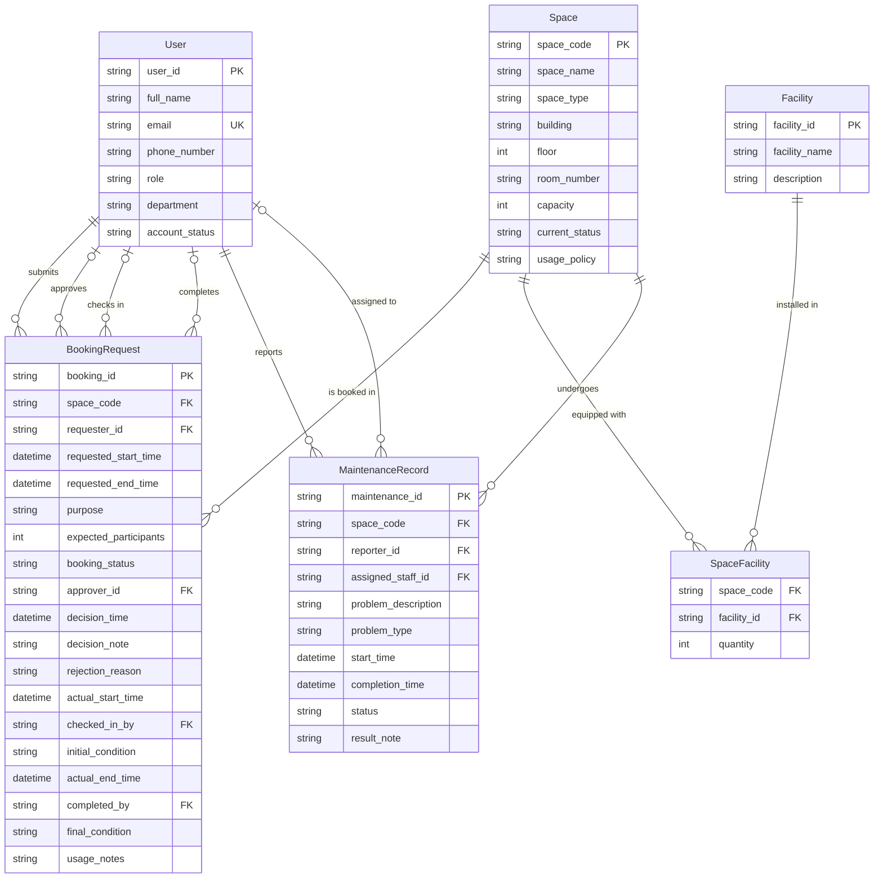

# Conceptual Design / ERD — CS486 Space Booking System

---

## Entity-Relationship Diagram (Crow's Foot Notation)

---

## Entity Descriptions

### 1. User
Represents any person who interacts with the system. Each user has a unique university account identified by `user_id`. The `role` determines what actions a user is permitted to perform. The `account_status` controls whether the user can log in and make bookings.

**Predefined Options:**
- Role: `student`, `lecturer`, `teaching_assistant`, `facility_staff`, `department_administrator`, `facility_manager`
- Account Status: `active`, `inactive`, `suspended`

### 2. Space
Represents a bookable physical space managed by the School. Each space is uniquely identified by a `space_code`. The `current_status` determines whether bookings are allowed. Spaces with status `under_maintenance`, `temporarily_closed`, or `retired` cannot be booked.

**Predefined Options:**
- Space Type: `auditorium`, `classroom`, `computer_laboratory`, `project_laboratory`, `meeting_room`, `student_workspace`
- Current Status: `available`, `in_use`, `under_maintenance`, `temporarily_closed`, `retired`

### 3. Facility
Represents a type of equipment or amenity that can be present in a space. Facilities are predefined and managed centrally.

**Predefined Options:**
- Facility Name: `projector`, `whiteboard`, `microphone`, `computer`, `livestreaming_equipment`, `air_conditioner`

### 4. SpaceFacility (Junction)
Links spaces to the facilities they contain and records the quantity of each facility type per space. Resolves the many-to-many relationship between Space and Facility.

### 5. BookingRequest
Represents a request to use a space for a specific time period and purpose. Tracks the full lifecycle from submission through approval, check-in, and completion.

**Lifecycle (Booking Status):**
`pending` → `approved` | `rejected` | `cancelled`  
`approved` → `checked_in` | `cancelled`  
`checked_in` → `completed` | `no-show`

**Predefined Options:**
- Purpose: `lecture`, `examination`, `seminar`, `workshop`, `meeting`, `student_activity`, `administrative_event`
- Booking Status: `pending`, `approved`, `rejected`, `cancelled`, `checked_in`, `completed`, `no-show`

### 6. MaintenanceRecord
Represents a reported maintenance issue for a space. Tracks the problem from reporting through assignment, resolution, and closure.

**Lifecycle (Status):**
`reported` → `in_progress` → `completed` | `cancelled`  
`reported` → `cancelled`

**Predefined Options:**
- Problem Type: `broken_projector`, `air_conditioning_failure`, `damaged_furniture`, `cleaning_issue`, `network_problem`
- Status: `reported`, `in_progress`, `completed`, `cancelled`

---

## Relationship Summary

| Left Entity | Relationship  | Right Entity      | Cardinality | Description                                                                                           |
| ----------- | ------------- | ----------------- | ----------- | ----------------------------------------------------------------------------------------------------- |
| User        | submits       | BookingRequest    | 1 → N       | A user can submit many booking requests.                                                              |
| Space       | is booked in  | BookingRequest    | 1 → N       | A space can appear in many booking requests (but with no overlapping approved time ranges).           |
| User        | approves      | BookingRequest    | 0..1 → N    | A facility staff or manager can approve/reject many bookings. A booking may not yet have an approver. |
| User        | checks in     | BookingRequest    | 0..1 → N    | A facility staff member can check in many bookings. A booking may not yet be checked in.              |
| User        | completes     | BookingRequest    | 0..1 → N    | A facility staff member can complete many bookings. A booking may not yet be completed.               |
| Space       | equipped with | SpaceFacility     | 1 → N       | A space can be linked to many facility records.                                                       |
| Facility    | installed in  | SpaceFacility     | 1 → N       | A facility type can be installed in many spaces.                                                      |
| User        | reports       | MaintenanceRecord | 1 → N       | Any user can report many maintenance issues.                                                          |
| User        | assigned to   | MaintenanceRecord | 0..1 → N    | A staff member can be assigned to many maintenance records. Not all records have an assignee.         |
| Space       | undergoes     | MaintenanceRecord | 1 → N       | A space can have many maintenance records over time.                                                  |

---

## Traceability

| Entity            | Derived From Requirement                                   |
| ----------------- | ---------------------------------------------------------- |
| User              | §10: user information, roles, account status               |
| Space             | §11: bookable space attributes, types, statuses            |
| Facility          | §12: facilities available in each space                    |
| SpaceFacility     | §12: many-to-many link between Space and Facility          |
| BookingRequest    | §13–16: booking submission, approval, check-in, completion |
| MaintenanceRecord | §17: maintenance reporting and tracking                    |
