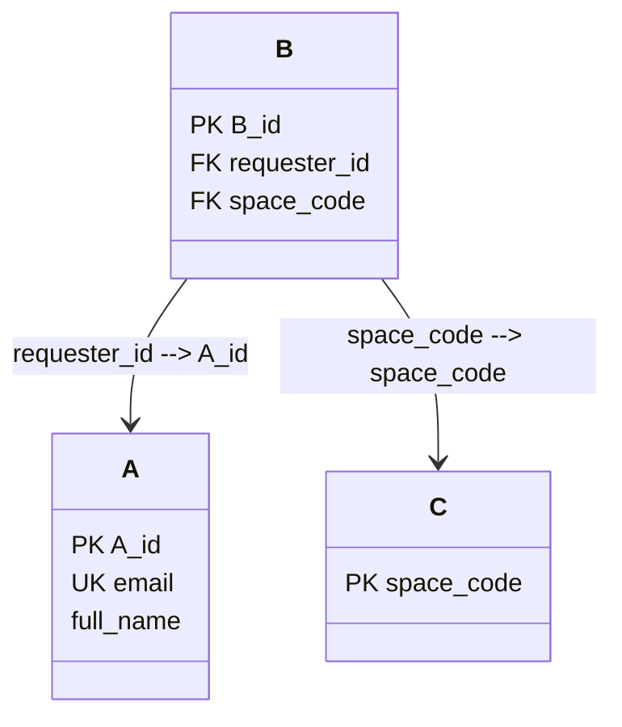

# Step 3: Logical Database Design

Based strictly on the output from [Step 2: Conceptual Design / ERD](../../../../outputs/02-erd-design-G02.md) and the output from [Step 1: Business Requirement Analysis](../../../../outputs/01-business-req-analysis-G02.md)

Save to:
`outputs/03-logical-design-G02.md`

## Output document structure
The document must contain exactly the following sections:

### 1. Relational Schema Diagram

Present the Relational schema diagram using Mermaid class diagram 

Requirements:

- Use Mermaid `classDiagram` syntax.
- Represent each relation as a class-like table block.
- Display all attributes belonging to each relation. Do not present data type of attributes
- Clearly identify:
  - `PK` for Primary Keys
  - `FK` for Foreign Keys
  - `UK` for Candidate Keys / Unique Keys
- Multiple key markers on one attribute are allowed via comma separation: `PK, FK`.
- Show foreign key dependencies using Mermaid association lines.
- Foreign key labels in the Mermaid diagram must clearly indicate both:
  - Referencing relation and attribute
  - Referenced relation and attribute

Example:


### 2. Detailed Table Schemas

For each relation defined in Section 1, provide a detailed table schema using a Markdown table.

Create a separate subsection for each relation using the format:

```md
#### RelationName
```

Use the following table structure:

| Column Name | Data Type | Nullability | Key / Constraint Type | Default Values & Inline Rules |
| ----------- | --------- | ----------- | --------------------- | ----------------------------- |

Requirements:

- Include every relation defined in the relational schema.
- Include every attribute belonging to the relation.
- Data types must use Microsoft SQL Server syntax:
  - `VARCHAR(n)`
  - `NVARCHAR(n)`
  - `INT`
  - `DATETIME`
  - Other SQL Server data types when appropriate.
- The data type of each attribute must remain consistent with `outputs/02-erd-design-G02.md`.
- Explicitly specify whether each column is:
  - `NOT NULL`
  - `NULL`
- Clearly identify all applicable key and constraint types:
  - `PK`
  - `FK`
  - `UK`
  - `CHECK`
  - Multiple constraint types may be combined (e.g., `PK, FK`).
- Document default values when applicable.
- Document domain constraints and allowed values for attributes with predefined options.

Examples:

```text
CHECK (role IN ('student','lecturer','teaching_assistant'))
```

```text
CHECK (booking_status IN ('pending','approved','rejected'))
```

```text
DEFAULT 'pending'
```

- For foreign key attributes, explicitly document the referenced relation and attribute.

Example:

```text
FK → User(user_id)
```

```text
FK → Space(space_code)
```

### 3. Business Rule Enforcement Map

Document how each business rule identified in Step 1 is enforced within the logical database design.

Present a Markdown table with the following columns:

| Business Rule ID | Business Rule Description | Enforcement Mechanism | Related Table(s) | Related Column(s) |
| ---------------- | ------------------------- | --------------------- | ---------------- | ----------------- |

Requirements:

- Use the original `BR-XX` identifiers from `outputs/01-business-req-analysis-G02.md`.
- Identify the most appropriate enforcement mechanism for each rule:
  - `PRIMARY KEY`
  - `FOREIGN KEY`
  - `UNIQUE`
  - `CHECK`
  - `NOT NULL`
  - `DEFAULT`
  - `Composite Key`
  - `Application Logic`
  - `Trigger / Stored Procedure`
- If a rule cannot be fully enforced using standard relational constraints, explicitly classify it as `Application Logic` or `Trigger / Stored Procedure`.
- Every business rule from Step 1 must appear exactly once.
- Ensure consistency with the tables, keys, and constraints defined in Sections 1 and 2.

Example:

- Unique user email → `UNIQUE`
- Booking status values → `CHECK`
- No overlapping approved bookings → `Trigger / Stored Procedure`
- Space under maintenance cannot be booked → `Application Logic`

---

## Workflow Execution Order (Strict)

1. **Internal Scan:**
  - Read `outputs/02-erd-design-G02.md` completely.
  - Identify all entities, attributes, relationships, keys, and constraints defined in the conceptual design.
  - Identify all predefined options, status values, domain constraints, and business rule references.
  - Determine the logical relations required for the relational schema.

2. **Generation**
  - Generate the Relational Schema Diagram.
  - Generate the Detailed Table Schemas
  - Generate the Business Rule Enforcement Map.

3. **Final Review & Export**
  - Verify that every entity from `outputs/02-erd-design-G02.md` appears as a relation.
  - Verify that all attributes, primary keys, foreign keys, candidate keys, and composite keys are preserved.
  - Ensure naming consistency between the Section 1, 2 and Step 2 conceptual design.
  - Ensure the data type of each attribute remain consistent with `outputs/02-erd-design-G02.md`.
  - Verify that every `BR-XX` business rule appears in the Business Rule Enforcement Map.
  - Verify consistency across all sections of the document.
  - Remove all placeholders and unresolved references.
  - Save the completed document to `outputs/03-logical-design-G02.md`.


