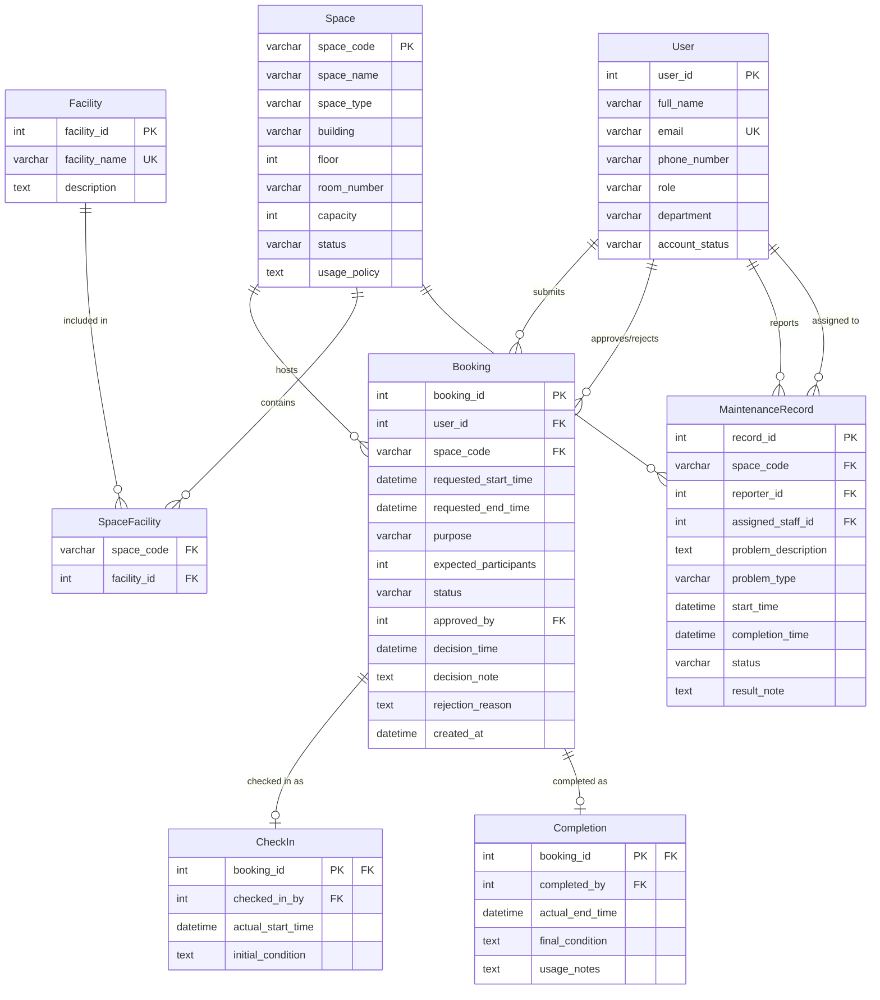

# Conceptual Database Design (ERD) — Group 02

## 1. Overview

This document presents the conceptual Entity-Relationship Diagram (ERD) for the School of Computer Science Shared Space Booking System. The design is based on the business requirement analysis document (`01-business-req-analysis-G02.md`). The ERD uses Crow's Foot notation and is rendered using Mermaid.

---

## 2. Entity-Relationship Diagram

---

## 3. Entity Descriptions

| Entity | Description |
|---|---|
| User | A person with a university account who interacts with the system (students, lecturers, TAs, facility staff, department admins, facility managers). |
| Space | A bookable physical space (auditorium, classroom, computer lab, project lab, meeting room, student workspace). |
| Facility | Equipment or amenities available in a space (projector, whiteboard, microphone, etc.). |
| SpaceFacility | Association entity linking Space and Facility in a many-to-many relationship. |
| Booking | A request to reserve a space for a specific purpose, time period, and participant count. |
| CheckIn | Tracks the actual start of a booking session, including the space's initial condition. |
| Completion | Tracks the actual end of a booking session, including the space's final condition and usage notes. |
| MaintenanceRecord | Documents maintenance problems reported for a space, including assignment and resolution. |

---

## 4. Relationship Summary

| Relationship | Entity 1 | Entity 2 | Cardinality | Description |
|---|---|---|---|---|
| submits | User | Booking | 1:N | A user can submit multiple booking requests. |
| approves/rejects | User | Booking | 1:N | A facility staff or manager can approve/reject multiple bookings. |
| hosts | Space | Booking | 1:N | A space can host multiple bookings over time. |
| contains | Space | SpaceFacility | 1:N | A space can contain multiple facilities. |
| included in | Facility | SpaceFacility | 1:N | A facility can be included in multiple spaces. |
| checked in as | Booking | CheckIn | 1:0..1 | A booking may be checked in at most once. |
| completed as | Booking | Completion | 1:0..1 | A booking may be completed at most once. |
| undergoes | Space | MaintenanceRecord | 1:N | A space can undergo multiple maintenance events. |
| reports | User | MaintenanceRecord | 1:N | A user can report multiple maintenance issues. |
| assigned to | User | MaintenanceRecord | 1:N | A staff member can be assigned to multiple maintenance records. |

---

## 5. Key Business Rules Enforced by the Design

- **Overlap prevention:** The Booking entity stores `space_code`, `requested_start_time`, and `requested_end_time`. Application logic will enforce that no two approved bookings exist with overlapping time ranges for the same space.
- **Unavailable space blocking:** The Space entity has a `status` attribute. Booking creation will check that the space status is `available`. Maintenance also updates space status.
- **Approval tracking:** The Booking entity includes `approved_by`, `decision_time`, `decision_note`, and `rejection_reason` directly, with `approved_by` as a nullable FK to User.
- **Lifecycle:** The Booking `status` attribute drives state transitions (pending → approved → checked_in → completed, with alternate paths for rejection, cancellation, and no-show).

---

## 6. Assumptions

1. The `approved_by` foreign key on Booking is nullable because not all bookings reach a decision state (e.g., pending or cancelled bookings have no approver).
2. CheckIn and Completion are separate weak entities identified by their Booking FK because they represent distinct events in the lifecycle and may not always occur.
3. SpaceFacility is a pure association table with no additional attributes.
4. The many-to-many relationship between Space and Facility is resolved with SpaceFacility (no multi-valued attributes).

---

## 7. Unresolved Questions

1. Should the design support recurring booking patterns (e.g., weekly lecture series)?
2. Should CheckIn and Completion be merged into a single "Session" entity with nullable end fields?
3. Should `approved_by` be moved to a separate Approval entity to support multi-step approval workflows?
4. Should a history/audit log entity be added to track all status changes on a Booking?
