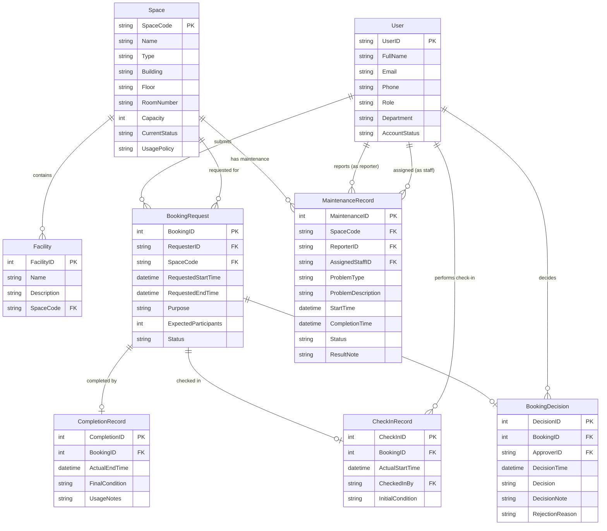

# Conceptual Design — ERD

> Based on [01-business-requirement-analysis.md](01-business-requirement-analysis.md)

## Entity-Relationship Diagram (Crow's Foot Notation)

## Entity Summary

| # | Entity | Description |
|---|--------|-------------|
| 1 | **User** | Individuals who interact with the system (students, lecturers, TAs, facility staff, admin, manager). |
| 2 | **Space** | A bookable physical room or area managed by the School. |
| 3 | **Facility** | Equipment or amenity installed in a space (e.g., projector, microphone). |
| 4 | **BookingRequest** | A request submitted by a user to reserve a space for a specific time and purpose. |
| 5 | **BookingDecision** | The approval or rejection outcome recorded by facility staff/manager. |
| 6 | **CheckInRecord** | Records the actual start of a usage session. |
| 7 | **CompletionRecord** | Records the end of a usage session and final condition. |
| 8 | **MaintenanceRecord** | Tracks a problem reported for a space and its resolution. |

## Relationship Summary

| Left Entity | Relationship | Right Entity | Business Meaning |
|-------------|--------------|--------------|------------------|
| User | 1 → N | BookingRequest | A user can submit many booking requests. |
| Space | 1 → N | BookingRequest | A space can be the subject of many booking requests. |
| BookingRequest | 1 → 1 | BookingDecision | Each booking request has exactly one decision outcome. |
| User | 1 → N | BookingDecision | A staff/manager user makes many booking decisions. |
| BookingRequest | 1 → 1 | CheckInRecord | A booking can be checked in at most once. |
| User | 1 → N | CheckInRecord | A staff user performs many check-ins. |
| BookingRequest | 1 → 1 | CompletionRecord | A booking can be completed at most once. |
| Space | 1 → N | Facility | A space contains many facilities. |
| Space | 1 → N | MaintenanceRecord | A space can have many maintenance records over time. |
| User | 1 → N | MaintenanceRecord | A user can report many issues and be assigned to many jobs. |

## Key Design Decisions

- **BookingDecision** is a separate entity (not an attribute of BookingRequest) because it has its own attributes (decision time, approver, note) and may need to be audited independently.
- **CheckInRecord** and **CompletionRecord** are separate entities to clearly track the two lifecycle events independently. A booking can be checked in but not yet completed (or become no-show without ever checking in).
- **Facility** is a weak entity dependent on Space; it exists only within the context of a space.
- **MaintenanceRecord** has two FK references to User (reporter and assigned staff), representing two distinct roles in the same entity.
