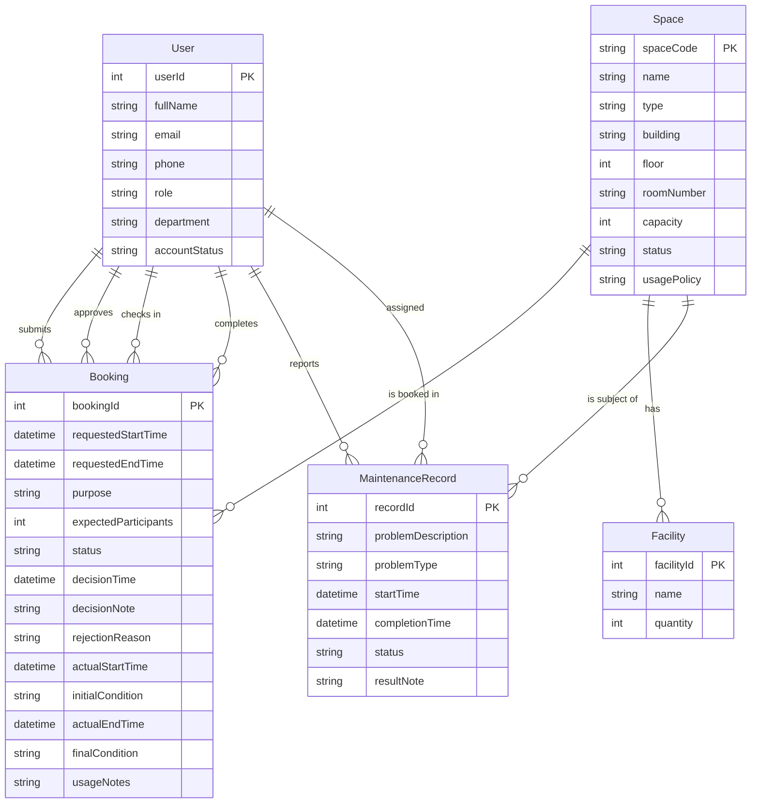

# Conceptual Design / ERD — School Space Booking System

> Based on [Business Requirement Analysis](01-business-requirement-analysis.md).

---

## Entity-Relationship Diagram (Mermaid)

---

## Entity Descriptions

| Entity | Description | Core Identifier |
|--------|-------------|-----------------|
| User | A person with a university account who interacts with the system. Roles include student, lecturer, TA, facility staff, department administrator, and facility manager. | `userId` |
| Space | A bookable physical room or area managed by the School (auditorium, classroom, lab, meeting room, etc.). | `spaceCode` |
| Facility | A piece of equipment or amenity available in a space (projector, whiteboard, computer, etc.). Quantity is tracked per space. | `facilityId` |
| Booking | A request or confirmed session for using a space. Tracks the full lifecycle: request → approval → check-in → completion. | `bookingId` |
| MaintenanceRecord | A reported problem or task for a space. Links the issue, reporter, assigned staff, and resolution. | `recordId` |

---

## Relationship Summary

| Left Entity | Right Entity | Cardinality | Verb Phrase | Business Meaning |
|-------------|-------------|-------------|-------------|------------------|
| User | Booking | 1 → N | submits | A user submits zero or many booking requests. Each booking is submitted by exactly one user. |
| User | Booking | 1 → N | approves | A facility staff member or manager approves/rejects zero or many bookings. Each approved/rejected booking records exactly one approver. |
| User | Booking | 1 → N | checks in | A facility staff member performs check-in for zero or many bookings. Each check-in records exactly one staff member. |
| User | Booking | 1 → N | completes | A facility staff member completes zero or many bookings. Each completed booking records exactly one staff member. |
| Space | Booking | 1 → N | is booked in | A space is referenced by zero or many bookings. Each booking is for exactly one space. |
| Space | Facility | 1 → N | has | A space contains zero or many facilities. Each facility belongs to exactly one space. |
| Space | MaintenanceRecord | 1 → N | is subject of | A space is the subject of zero or many maintenance records. Each maintenance record is for exactly one space. |
| User | MaintenanceRecord | 1 → N | reports | A user reports zero or many maintenance issues. Each maintenance record is reported by exactly one user. |
| User | MaintenanceRecord | 1 → N | assigned | A facility staff member is assigned to zero or many maintenance records. Each maintenance record may be assigned to one staff member (optional). |

---

## Key Conceptual Design Decisions

1. **Booking as a single entity with lifecycle attributes** — Approval, check-in, and completion details (approver, decision time, actual start time, etc.) are stored directly on the Booking entity rather than as separate entities. This reflects the 1:1 nature of these relationships and simplifies the model.

2. **Facility as a dependent entity of Space** — A Facility record belongs to exactly one Space. Quantity is tracked to support spaces with multiple units of the same equipment type (e.g., 30 computers in a lab).

3. **User participates in multiple roles** — The User entity records a single primary role. A user who is both a lecturer and facility staff (unlikely in practice but possible) would require separate accounts or a role-mapping table in a later logical design.

4. **All bookings require approval** — No auto-approval paths exist. Every booking must transition through `pending → approved` before check-in.
