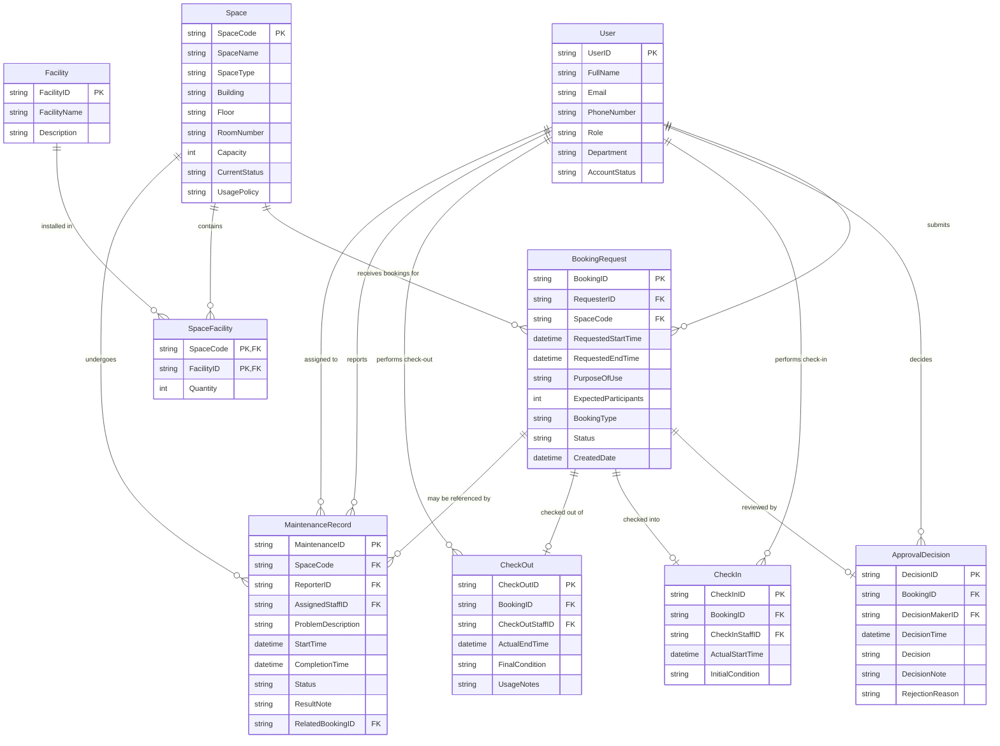

# Conceptual Design — ERD

> ERD for the School Shared Space Booking System.

---

## ER Diagram (Crow's Foot Notation)

---

## Entity Descriptions

| Entity | Description |
|--------|-------------|
| User | A university account holder who interacts with the system. Roles include student, lecturer, teaching_assistant, facility_staff, department_administrator, facility_manager. |
| Space | A bookable physical space managed by the School (auditorium, classroom, computer lab, project lab, meeting room, or student workspace). |
| Facility | A type of equipment or amenity that may be present in a space (projector, whiteboard, microphone, computer, etc.). |
| SpaceFacility | Associative entity linking spaces to facilities with a quantity, recording how many units of a facility exist in a given space. |
| BookingRequest | A request submitted by a user to reserve a space for a specific time period and purpose. |
| ApprovalDecision | Records the approval or rejection of a booking request, including who decided and when. |
| CheckIn | Records the start of a booking session — actual start time, staff member who checked in, and initial condition of the space. |
| CheckOut | Records the end of a booking session — actual end time, final condition, and usage notes. |
| MaintenanceRecord | Records a maintenance problem reported for a space, optionally linked to the booking during which it was discovered. |

---

## Key Cardinality Notes

- **User → BookingRequest**: A user may submit multiple requests; each request is submitted by exactly one user.
- **Space → BookingRequest**: A space can receive many booking requests; each request is for exactly one space.
- **BookingRequest → ApprovalDecision**: A booking request has at most one approval decision record (0 or 1).
- **BookingRequest → CheckIn**: A booking request has at most one check-in record (0 or 1).
- **BookingRequest → CheckOut**: A booking request has at most one check-out record (0 or 1), which requires a check-in to exist first.
- **Space → MaintenanceRecord**: A space may have many maintenance records; each record is for exactly one space.
- **MaintenanceRecord → BookingRequest (optional)**: A maintenance record may optionally reference the booking during which the problem was reported.
- **User → MaintenanceRecord**: A user can be the reporter of many maintenance records and the assigned staff for many maintenance records.
- **Space : Facility (M:N via SpaceFacility)**: A space can have many facilities; a facility type can be installed in many spaces.
