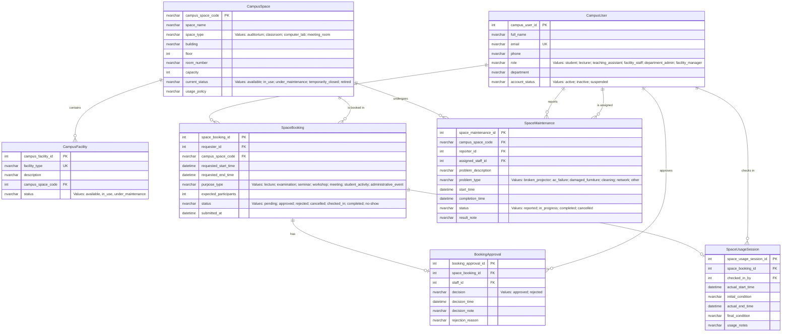

# Conceptual ERD Design — Crow's Foot Notation

**Group:** G02

**Date:** 2026-06-27

---

## 1. Mermaid ER Diagram

---

## 2. Entity Descriptions

### 2.1. CampusUser
Represents any person who interacts with the system using a university account. Has a role that determines permissions (student, lecturer, TA, facility staff, department admin, facility manager).

### 2.2. CampusSpace
A bookable physical room or area on campus managed by the School of Computer Science.

### 2.3. CampusFacility
A piece of equipment or amenity that may be installed in a campus space (e.g., projector, whiteboard, air conditioner).

### 2.4. SpaceBooking
A booking request submitted by a campus user to reserve a specific campus space for a specific time period and purpose.

### 2.5. BookingApproval
The decision record for a space booking. Linked to exactly one booking. Captures who decided, when, and any notes.

### 2.6. SpaceUsageSession
The actual usage record when a booking is checked in and later checked out. Tracks real start/end times and space condition.

### 2.7. SpaceMaintenance
A log of a maintenance issue reported for a campus space. Tracks problem description, assignment, status, and resolution.

---

## 3. Relationship Summary

| ID | Entity A | Entity B | Cardinality | Participation |
|---|---|---|---|---|
| R1 | CampusUser | SpaceBooking | 1:N | CampusUser: optional, SpaceBooking: mandatory |
| R2 | CampusSpace | SpaceBooking | 1:N | CampusSpace: optional, SpaceBooking: mandatory |
| R3 | CampusSpace | CampusFacility | 1:N | Both optional |
| R4 | SpaceBooking | BookingApproval | 1:0..1 | SpaceBooking: optional, BookingApproval: mandatory |
| R5 | CampusUser (staff) | BookingApproval | 1:N | CampusUser: optional, BookingApproval: mandatory |
| R6 | SpaceBooking | SpaceUsageSession | 1:0..1 | SpaceBooking: optional, SpaceUsageSession: mandatory |
| R7 | CampusUser (staff) | SpaceUsageSession | 1:N | CampusUser: optional, SpaceUsageSession: mandatory |
| R8 | CampusSpace | SpaceMaintenance | 1:N | CampusSpace: optional, SpaceMaintenance: mandatory |
| R9 | CampusUser (reporter) | SpaceMaintenance | 1:N | CampusUser: optional, SpaceMaintenance: mandatory |
| R10 | CampusUser (assignee) | SpaceMaintenance | 1:N | CampusUser: optional, SpaceMaintenance: mandatory |

---

## 4. Traceability to Business Requirement Analysis

| Entity | Derived From (Section 3 of Business Requirement Analysis) |
|---|---|
| CampusUser | E1 |
| CampusSpace | E2 |
| CampusFacility | E3 |
| SpaceBooking | E4 |
| BookingApproval | E5 |
| SpaceUsageSession | E6 |
| SpaceMaintenance | E7 |

All relationships (R1–R10) map directly to the relationship analysis in Section 5 of the Business Requirement Analysis.
