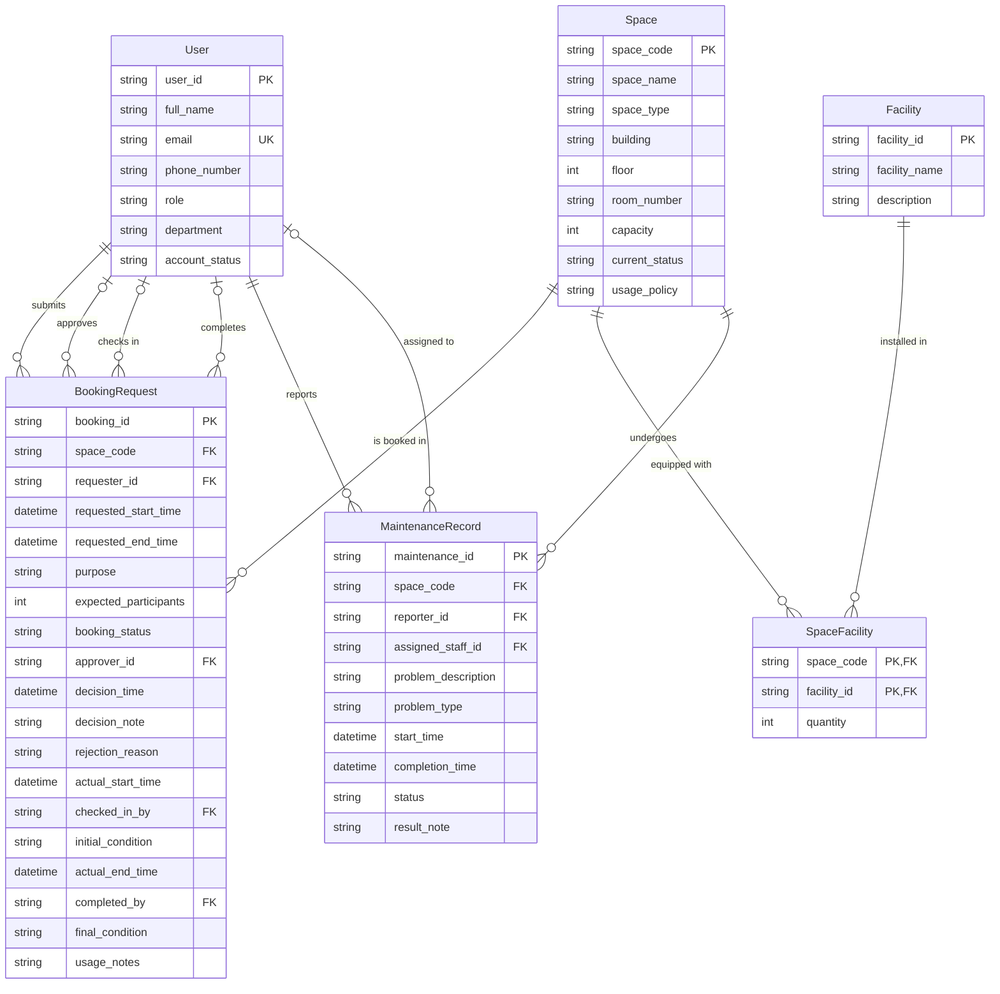

# Conceptual Design / ERD — CS486 Space Booking System

> Based on: [Business Requirement Analysis](01-business-req-analysis-G02.md)

---

## 1. Entity-Relationship Diagram (Crow's Foot Notation)

---

## 2. Entity Descriptions

### 1. User
Represents any person who interacts with the system. Each user has a unique university account identified by `user_id`. The `role` determines what actions a user is permitted to perform. The `account_status` controls whether the user can log in and make bookings.

**Predefined Options:**
- Role: `student`, `lecturer`, `teaching_assistant`, `facility_staff`, `department_administrator`, `facility_manager`
- Account Status: `active`, `inactive`, `suspended`

**Constraints (from Business Rules):**
- Each user must have a unique email address (BR-03).

### 2. Space
Represents a bookable physical space managed by the School. Each space is uniquely identified by a `space_code`. The `current_status` determines whether bookings are allowed.

**Predefined Options:**
- Space Type: `auditorium`, `classroom`, `computer_laboratory`, `project_laboratory`, `meeting_room`, `student_workspace`
- Current Status: `available`, `in_use`, `under_maintenance`, `temporarily_closed`, `retired`

**Constraints (from Business Rules):**
- A space with status `under_maintenance`, `temporarily_closed`, or `retired` cannot be booked (BR-06).
- A space with an active maintenance record (status `reported` or `in_progress`) must have its `current_status` set to `under_maintenance` (BR-21).

### 3. Facility
Represents a type of equipment or amenity that can be present in a space. Facilities are predefined and managed centrally.

**Predefined Options:**
- Facility Name: `projector`, `whiteboard`, `microphone`, `computer`, `livestreaming_equipment`, `air_conditioner`

### 4. SpaceFacility (Junction)
Links spaces to the facilities they contain and records the quantity of each facility type per space. Resolves the many-to-many relationship between Space and Facility. Uses a composite primary key of `(space_code, facility_id)`.

### 5. BookingRequest
Represents a request to use a space for a specific time period and purpose. Tracks the full lifecycle from submission through approval, check-in, and completion.

**Lifecycle (Booking Status):**
`pending` → `approved` | `rejected` | `cancelled` 
`approved` → `checked_in` | `cancelled` | `no-show`
`checked_in` → `completed` 

**Predefined Options:**
- Purpose: `lecture`, `examination`, `seminar`, `workshop`, `meeting`, `student_activity`, `administrative_event`
- Booking Status: `pending`, `approved`, `rejected`, `cancelled`, `checked_in`, `completed`, `no-show`

**Constraints (from Business Rules):**
- A space under maintenance, temporarily closed, or retired cannot be booked (BR-06).
- No two approved bookings may overlap in time for the same space (BR-10).
- Expected participants must not exceed space capacity (BR-11).
- Maximum booking duration is 4 hours (BR-12).
- Bookings can be made up to 6 months in advance (BR-13).
- All booking requests require approval from a facility staff member or facility manager (BR-09, BR-14).
- Only facility staff can check in a booking (BR-15).
- Only facility staff can complete a booking (BR-16).
- A booking that reaches its requested end time without being checked in is marked as no-show (BR-17).
- Historical records must be maintained indefinitely for reporting (BR-22).

### 6. MaintenanceRecord
Represents a reported maintenance issue for a space. Tracks the problem from reporting through assignment, resolution, and closure.

**Lifecycle (Status):**
`reported` → `in_progress` → `completed` | `cancelled`
`reported` → `cancelled`

**Predefined Options:**
- Problem Type: `broken_projector`, `air_conditioning_failure`, `damaged_furniture`, `cleaning_issue`, `network_problem`
- Status: `reported`, `in_progress`, `completed`, `cancelled`

**Constraints (from Business Rules):**
- A space with an active maintenance record (status `reported` or `in_progress`) must have its `current_status` set to `under_maintenance` and cannot be booked (BR-21).
- Historical records must be maintained indefinitely for reporting (BR-22).

---

## 3. Relationship Summary

| Left Entity | Relationship | Right Entity | Left Participation | Right Participation | Cardinality | Description |
| ----------- | ------------ | ------------ | ------------------ | ------------------- | ----------- | ----------- |
| User | submits | BookingRequest | optional | mandatory | 1 → N | A user may submit zero or more booking requests; each booking must have exactly one requester. |
| Space | is booked in | BookingRequest | optional | mandatory | 1 → N | A space may appear in zero or more booking requests; each booking references exactly one space. |
| User (approver) | approves | BookingRequest | optional | optional | 0..1 → N | A facility staff or facility manager may approve/reject many bookings; a booking may not yet have an approver. |
| User (check-in) | checks in | BookingRequest | optional | optional | 0..1 → N | A facility staff member may check in many bookings; a booking may not yet be checked in. |
| User (completes) | completes | BookingRequest | optional | optional | 0..1 → N | A facility staff member may complete many bookings; a booking may not yet be completed. |
| Space | equipped with | SpaceFacility | optional | mandatory | 1 → N | A space may have zero or more facility records; each SpaceFacility record links exactly one space to one facility. |
| Facility | installed in | SpaceFacility | optional | mandatory | 1 → N | A facility may be present in zero or more spaces; each SpaceFacility record links exactly one facility to one space. |
| User (reporter) | reports | MaintenanceRecord | optional | mandatory | 1 → N | Any user may report zero or more maintenance issues; each record has exactly one reporter. |
| User (assigned) | assigned to | MaintenanceRecord | optional | optional | 0..1 → N | A facility staff or manager may be assigned to zero or more maintenance records; a record may not yet have an assignee. |
| Space | undergoes | MaintenanceRecord | optional | mandatory | 1 → N | A space may have zero or more maintenance records; each record is for exactly one space. |

**Participation Legend:**
- `mandatory` (total) — every instance of the entity must participate in the relationship.
- `optional` (partial) — some instances of the entity may not participate.
- Cardinality `1 → N`: one on the left, many on the right.
- Cardinality `0..1 → N`: zero-or-one on the left, many on the right.

---

## 4. Traceability

| Entity | Derived From Requirement |
| ------ | ------------------------ |
| User | Section 3 (Entities), User row: user information, roles, account status; Section 5 (Rules): BR-01, BR-02, BR-03 |
| Space | Section 3 (Entities), Space row: bookable space attributes, types, statuses; Section 5 (Rules): BR-04, BR-05, BR-06, BR-21 |
| Facility | Section 3 (Entities), Facility row: facilities available in each space; Section 5 (Rules): BR-18 |
| SpaceFacility | Section 3 (Entities), SpaceFacility row: many-to-many link; Section 4 (Relationships): Space has Facility (M → N) |
| BookingRequest | Section 3 (Entities), BookingRequest row: lifecycle attributes; Section 4 (Relationships): submission, approval, check-in, completion; Section 5 (Rules): BR-07 through BR-17, BR-22 |
| MaintenanceRecord | Section 3 (Entities), MaintenanceRecord row: maintenance attributes; Section 4 (Relationships): reporting and assignment; Section 5 (Rules): BR-19, BR-20, BR-21, BR-22 |
