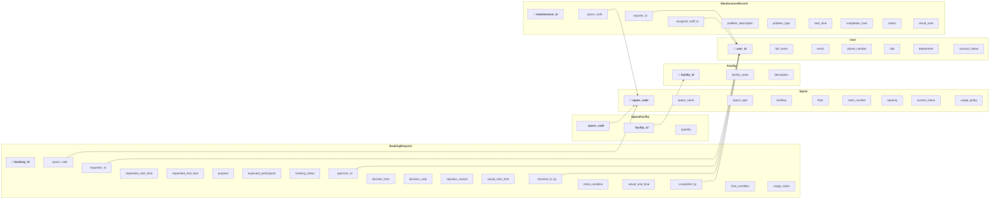

# Logical Database Design — School Shared Space Booking System

> Based on: [Conceptual Design / ERD](02-erd-design-G02.md) and [Business Requirement Analysis](01-business-req-analysis-G02.md)

---

## 1. Relational Schema Diagram

---

## 2. Business Rule Enforcement Map

| Business Rule ID | Business Rule Description | Enforcement Mechanism | Related Relation(s) | Related Attribute(s) |
| ---------------- | ------------------------- | --------------------- | ------------------- | -------------------- |
| BR-01 | User roles are limited to: student, lecturer, teaching_assistant, facility_staff, department_administrator, facility_manager. | CHECK | User | role |
| BR-02 | Account statuses: active, inactive, suspended. | CHECK | User | account_status |
| BR-03 | Space types: auditorium, classroom, computer_laboratory, project_laboratory, meeting_room, student_workspace. | CHECK | Space | space_type |
| BR-04 | Space statuses: available, in_use, under_maintenance, temporarily_closed, retired. | CHECK | Space | current_status |
| BR-05 | Booking types: lecture, examination, seminar, workshop, meeting, student_activity, administrative_event. | CHECK | BookingRequest | purpose |
| BR-06 | Booking request statuses: pending, approved, rejected, cancelled, checked_in, completed, no_show. | CHECK | BookingRequest | booking_status |
| BR-07 | All booking requests require approval by a facility staff member or facility manager before the space can be used. | Application Logic | BookingRequest | booking_status, approver_id |
| BR-08 | A booking request in pending status can be approved or rejected by a facility staff member or manager. | Application Logic | BookingRequest | booking_status |
| BR-09 | Allowed booking status transitions: pending → approved \| rejected \| cancelled; approved → checked_in \| cancelled; checked_in → completed \| no_show; pending → cancelled; approved → cancelled. | Trigger / Stored Procedure | BookingRequest | booking_status |
| BR-10 | The same space cannot have two approved bookings with overlapping time periods (conflict detection: approved bookings for the same space must not have overlapping [start_time, end_time] intervals). | Trigger / Stored Procedure | BookingRequest | space_code, requested_start_time, requested_end_time, booking_status |
| BR-11 | A space that is under maintenance, temporarily closed, or retired cannot be booked. | Application Logic | Space, BookingRequest | current_status |
| BR-12 | Any user role may book any space type (no role-based eligibility restrictions). | Application Logic | User, Space | role, space_type |
| BR-13 | Maintenance record statuses: reported, in_progress, completed, cancelled. | CHECK | MaintenanceRecord | status |
| BR-14 | When a space's status is set to under_maintenance via a maintenance record, the system must prevent new approved bookings for that space until the maintenance is completed. | Application Logic | Space, MaintenanceRecord, BookingRequest | current_status, status |
| BR-15 | A maintenance record may optionally be linked to a specific booking request (for problems reported during a session). | Application Logic | MaintenanceRecord | — |
| BR-16 | Check-in records the actual start time, the identity of the staff member performing the check-in, and the initial condition of the space. | Application Logic | BookingRequest | actual_start_time, checked_in_by, initial_condition, booking_status |
| BR-17 | Check-out records the actual end time, final condition of the space, and usage notes. It is performed by facility staff. | Application Logic | BookingRequest | actual_end_time, completed_by, final_condition, usage_notes, booking_status |
| BR-18 | If the requester does not check in, the booking status moves to no_show. (Transition from approved → no_show.) | Trigger / Stored Procedure | BookingRequest | booking_status, actual_start_time |
| BR-19 | The system must maintain full historical records of all bookings, approval decisions, check-in/check-out records, and maintenance activities indefinitely for reporting. | Application Logic | All | — |
| BR-20 | A rejected booking must store the rejection reason. | CHECK | BookingRequest | rejection_reason, booking_status |
| BR-21 | The facility manager can manage the space catalog (add, update, or retire spaces and their facilities). | Application Logic | Space, Facility | — |
| BR-22 | Each space may have multiple facilities; each facility type may be installed in multiple spaces (M:N relationship via SpaceFacility with quantity). | Composite Key, FOREIGN KEY | SpaceFacility, Space, Facility | space_code, facility_id |
