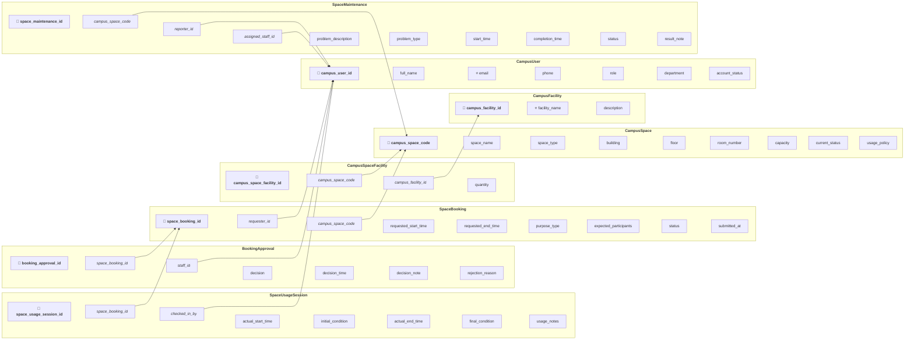

# Logical Database Design — Relational Schema

**Group:** G02

**Date:** 2026-06-27

---

## 1. Relational Schema Diagram & Notation

**Key Notation:**
- `🔑` = Primary Key (PK)
- `🔗` = Foreign Key (FK)
- `⭐` = Candidate Key / Unique Key (UK)

**Text Formatting:**
- **Bold** text = Primary Key attribute
- *Italic* text = Foreign Key attribute
- ***Bold italic*** text = Attribute that is both PK and FK

---

## 2. Business Rule Enforcement Map

| Business Rule ID | Business Rule Description | Enforcement Mechanism | Related Relation(s) | Related Attribute(s) |
| ---------------- | ------------------------- | --------------------- | ------------------- | -------------------- |
| BR-01 | A space cannot have two approved bookings with overlapping time periods. | Trigger / Stored Procedure | SpaceBooking | requested_start_time, requested_end_time, status |
| BR-02 | A space under maintenance, temporarily closed, or retired cannot be booked. | Application Logic | CampusSpace, SpaceBooking | current_status |
| BR-03 | A booking status flows: pending → approved/rejected/cancelled → checked_in → completed/no-show. | CHECK, Trigger / Stored Procedure | SpaceBooking | status |
| BR-04 | Rejection reason is required when a booking is rejected. | CHECK | BookingApproval | decision, rejection_reason |
| BR-05 | An approval decision must be made by a facility staff member or facility manager. | Application Logic | BookingApproval, CampusUser | staff_id, role |
| BR-06 | Check-in must be performed by facility staff. | Application Logic | SpaceUsageSession, CampusUser | checked_in_by, role |
| BR-07 | Expected participants must not exceed space capacity. | CHECK, Application Logic | SpaceBooking, CampusSpace | expected_participants, capacity |
| BR-08 | A booking's start time must be before its end time. | CHECK | SpaceBooking | requested_start_time, requested_end_time |
| BR-09 | Maintenance status "in_progress" should prevent new bookings for the space. | Application Logic | SpaceMaintenance, SpaceBooking | status, campus_space_code |
| BR-10 | Historical records must be preserved (no hard deletes of completed bookings or maintenance). | Application Logic | All tables | N/A |
