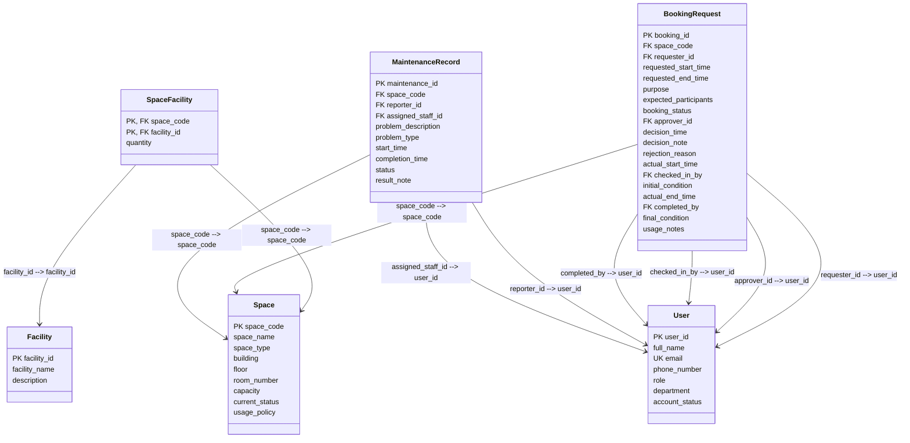

# Logical Database Design — CS486 Space Booking System

> Based on: [Conceptual Design / ERD](02-erd-design-G02.md) and [Business Requirement Analysis](01-business-req-analysis-G02.md)

---

## 1. Relational Schema Diagram

---

## 2. Detailed Table Schemas

### User

| Column Name | Data Type | Nullability | Key / Constraint Type | Default Values & Inline Rules |
| ----------- | --------- | ----------- | --------------------- | ----------------------------- |
| user_id | VARCHAR(20) | NOT NULL | PK | |
| full_name | NVARCHAR(100) | NOT NULL | | |
| email | VARCHAR(100) | NOT NULL | UK | |
| phone_number | VARCHAR(20) | NULL | | |
| role | VARCHAR(30) | NOT NULL | CHECK | CHECK (role IN ('student','lecturer','teaching_assistant','facility_staff','department_administrator','facility_manager')) |
| department | NVARCHAR(100) | NOT NULL | | |
| account_status | VARCHAR(20) | NOT NULL | CHECK | DEFAULT 'active' CHECK (account_status IN ('active','inactive','suspended')) |

### Space

| Column Name | Data Type | Nullability | Key / Constraint Type | Default Values & Inline Rules |
| ----------- | --------- | ----------- | --------------------- | ----------------------------- |
| space_code | VARCHAR(20) | NOT NULL | PK | |
| space_name | NVARCHAR(100) | NOT NULL | | |
| space_type | VARCHAR(30) | NOT NULL | CHECK | CHECK (space_type IN ('auditorium','classroom','computer_laboratory','project_laboratory','meeting_room','student_workspace')) |
| building | NVARCHAR(100) | NOT NULL | | |
| floor | INT | NOT NULL | | |
| room_number | VARCHAR(20) | NOT NULL | | |
| capacity | INT | NOT NULL | CHECK | CHECK (capacity > 0) |
| current_status | VARCHAR(30) | NOT NULL | CHECK | DEFAULT 'available' CHECK (current_status IN ('available','in_use','under_maintenance','temporarily_closed','retired')) |
| usage_policy | NVARCHAR(500) | NULL | | |

### Facility

| Column Name | Data Type | Nullability | Key / Constraint Type | Default Values & Inline Rules |
| ----------- | --------- | ----------- | --------------------- | ----------------------------- |
| facility_id | VARCHAR(20) | NOT NULL | PK | |
| facility_name | VARCHAR(50) | NOT NULL | CHECK | CHECK (facility_name IN ('projector','whiteboard','microphone','computer','livestreaming_equipment','air_conditioner')) |
| description | NVARCHAR(255) | NULL | | |

### SpaceFacility

| Column Name | Data Type | Nullability | Key / Constraint Type | Default Values & Inline Rules |
| ----------- | --------- | ----------- | --------------------- | ----------------------------- |
| space_code | VARCHAR(20) | NOT NULL | PK, FK | FK → Space(space_code) |
| facility_id | VARCHAR(20) | NOT NULL | PK, FK | FK → Facility(facility_id) |
| quantity | INT | NOT NULL | CHECK | DEFAULT 1 CHECK (quantity > 0) |

### BookingRequest

| Column Name | Data Type | Nullability | Key / Constraint Type | Default Values & Inline Rules |
| ----------- | --------- | ----------- | --------------------- | ----------------------------- |
| booking_id | VARCHAR(30) | NOT NULL | PK | |
| space_code | VARCHAR(20) | NOT NULL | FK | FK → Space(space_code) |
| requester_id | VARCHAR(20) | NOT NULL | FK | FK → User(user_id) |
| requested_start_time | DATETIME | NOT NULL | CHECK | CHECK (requested_start_time < requested_end_time) |
| requested_end_time | DATETIME | NOT NULL | | |
| purpose | VARCHAR(30) | NOT NULL | CHECK | CHECK (purpose IN ('lecture','examination','seminar','workshop','meeting','student_activity','administrative_event')) |
| expected_participants | INT | NOT NULL | CHECK | CHECK (expected_participants > 0) |
| booking_status | VARCHAR(20) | NOT NULL | CHECK | DEFAULT 'pending' CHECK (booking_status IN ('pending','approved','rejected','cancelled','checked_in','completed','no-show')) |
| approver_id | VARCHAR(20) | NULL | FK | FK → User(user_id) |
| decision_time | DATETIME | NULL | | |
| decision_note | NVARCHAR(500) | NULL | | |
| rejection_reason | NVARCHAR(500) | NULL | | |
| actual_start_time | DATETIME | NULL | | |
| checked_in_by | VARCHAR(20) | NULL | FK | FK → User(user_id) |
| initial_condition | NVARCHAR(500) | NULL | | |
| actual_end_time | DATETIME | NULL | | |
| completed_by | VARCHAR(20) | NULL | FK | FK → User(user_id) |
| final_condition | NVARCHAR(500) | NULL | | |
| usage_notes | NVARCHAR(500) | NULL | | |

### MaintenanceRecord

| Column Name | Data Type | Nullability | Key / Constraint Type | Default Values & Inline Rules |
| ----------- | --------- | ----------- | --------------------- | ----------------------------- |
| maintenance_id | VARCHAR(30) | NOT NULL | PK | |
| space_code | VARCHAR(20) | NOT NULL | FK | FK → Space(space_code) |
| reporter_id | VARCHAR(20) | NOT NULL | FK | FK → User(user_id) |
| assigned_staff_id | VARCHAR(20) | NULL | FK | FK → User(user_id) |
| problem_description | NVARCHAR(500) | NOT NULL | | |
| problem_type | VARCHAR(30) | NOT NULL | CHECK | CHECK (problem_type IN ('broken_projector','air_conditioning_failure','damaged_furniture','cleaning_issue','network_problem')) |
| start_time | DATETIME | NOT NULL | | |
| completion_time | DATETIME | NULL | | |
| status | VARCHAR(20) | NOT NULL | CHECK | DEFAULT 'reported' CHECK (status IN ('reported','in_progress','completed','cancelled')) |
| result_note | NVARCHAR(500) | NULL | | |

---

## 3. Business Rule Enforcement Map

| Business Rule ID | Business Rule Description | Enforcement Mechanism | Related Table(s) | Related Column(s) |
| ---------------- | ------------------------- | --------------------- | ---------------- | ----------------- |
| BR-01 | User roles are limited to: student, lecturer, teaching_assistant, facility_staff, department_administrator, facility_manager. | CHECK | User | role |
| BR-02 | Account statuses: active, inactive, suspended. | CHECK | User | account_status |
| BR-03 | Space types: auditorium, classroom, computer_laboratory, project_laboratory, meeting_room, student_workspace. | CHECK | Space | space_type |
| BR-04 | Space statuses: available, in_use, under_maintenance, temporarily_closed, retired. | CHECK | Space | current_status |
| BR-05 | Booking types: lecture, examination, seminar, workshop, meeting, student_activity, administrative_event. | CHECK | BookingRequest | purpose |
| BR-06 | Booking request statuses: pending, approved, rejected, cancelled, checked_in, completed, no_show. | CHECK | BookingRequest | booking_status |
| BR-07 | All booking requests require approval by a facility staff member or facility manager before the space can be used. | Application Logic | BookingRequest | booking_status, approver_id |
| BR-08 | A booking request in pending status can be approved or rejected by a facility staff member or manager. | Application Logic | BookingRequest | booking_status, approver_id |
| BR-09 | Allowed booking status transitions: pending → approved \| rejected \| cancelled; approved → checked_in \| cancelled; checked_in → completed \| no_show; pending → cancelled; approved → cancelled. | Trigger / Stored Procedure | BookingRequest | booking_status |
| BR-10 | The same space cannot have two approved bookings with overlapping time periods. | Trigger / Stored Procedure | BookingRequest | space_code, requested_start_time, requested_end_time, booking_status |
| BR-11 | A space that is under maintenance, temporarily closed, or retired cannot be booked. | Application Logic | Space | current_status |
| BR-12 | Any user role may book any space type (no role-based eligibility restrictions). | Application Logic | BookingRequest, Space | — |
| BR-13 | Maintenance record statuses: reported, in_progress, completed, cancelled. | CHECK | MaintenanceRecord | status |
| BR-14 | When a space's status is set to under_maintenance via a maintenance record, the system must prevent new approved bookings for that space until the maintenance is completed. | Trigger / Stored Procedure | Space, MaintenanceRecord, BookingRequest | current_status, status, booking_status |
| BR-15 | A maintenance record may optionally be linked to a specific booking request (for problems reported during a session). | Application Logic | MaintenanceRecord | — |
| BR-16 | Check-in records the actual start time, the identity of the staff member performing the check-in, and the initial condition of the space. | FOREIGN KEY, NOT NULL (conditional) | BookingRequest | actual_start_time, checked_in_by, initial_condition |
| BR-17 | Check-out records the actual end time, final condition of the space, and usage notes. It is performed by facility staff. | FOREIGN KEY, NOT NULL (conditional) | BookingRequest | actual_end_time, completed_by, final_condition, usage_notes |
| BR-18 | If the requester does not check in, the booking status moves to no_show. | Trigger / Stored Procedure | BookingRequest | booking_status |
| BR-19 | The system must maintain full historical records of all bookings, approval decisions, check-in/check-out records, and maintenance activities indefinitely for reporting. | Application Logic | All tables | — |
| BR-20 | A rejected booking must store the rejection reason. | CHECK (conditional) | BookingRequest | rejection_reason, booking_status |
| BR-21 | The facility manager can manage the space catalog (add, update, or retire spaces and their facilities). | Application Logic | Space, Facility, SpaceFacility | — |
| BR-22 | Each space may have multiple facilities; each facility type may be installed in multiple spaces (M:N relationship via SpaceFacility with quantity). | Composite Key, FOREIGN KEY | SpaceFacility | space_code, facility_id |
