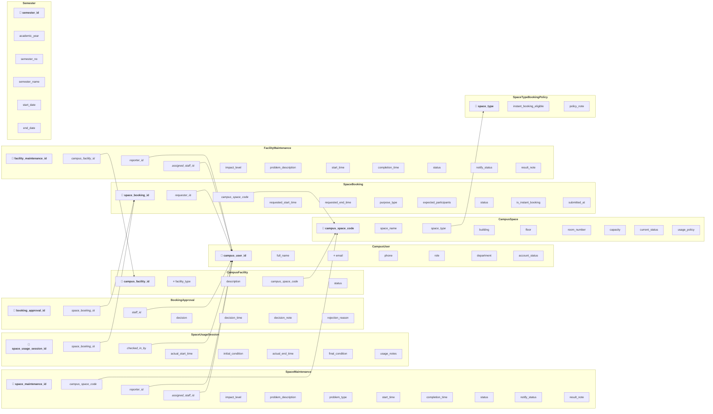

# Updated ERD and Logical Database Design

**Group:** G02

**Phase:** Phase 2 — Design Update (Step 09)

**Task:** Updated ERD and Logical Database Design for the Campus Space Management System

**Generation date:** 2026-07-31

---

## 1. Design Scope and Source Baseline

This artifact updates the Phase 1 conceptual ERD and relational schema of the Campus Space Management System so the design supports the Phase 2 requirements: maintenance impact levels, advisory notification and acknowledgement records, instant and staff-approved booking paths, prevention of conflicting approved bookings under concurrent operations, and the new reporting needs (in particular identifying bookings affected by maintenance escalation).

**Phase 1 baseline artifacts:**

- `outputs/01-business-req-analysis-G02.md` (entities, relationships, business rules BR-01 … BR-10)
- `outputs/02-erd-design-G02.md` (Phase 1 conceptual ERD)
- `outputs/03-logical-design-G02.md` (Phase 1 relational schema)
- `outputs/04-design-validation-G02.md` (Phase 1 validation)
- `outputs/05-db-definition-G02.sql` (implemented Phase 1 DDL — authoritative for actual column names, key semantics, and constraints)

**Phase 2 requirements driving the changes:**

- `CS486_Project_Phase02(2).md` → `CS486_Project_Phase02.md`, §1.1 maintenance impact levels, §1.2 concurrent booking and approval, §1.3 new reporting needs.
- `new_requirement.md` (`req/new_requirement.md`) — same three change areas, treated as the highest-priority source.

**Analysis input:**

- `outputs/08-requirement-change-analysis-G02.md` (Step 08) — used as an input, validated against the authoritative Phase 2 requirements. Corrections are recorded in Section 2 and Section 5.

**Intentionally deferred to later artifacts:**

- Schema migration DDL (existing data preservation, new column defaults, config seeding) → `10-schema-migration-G02.sql`.
- Concurrency-control implementation (locking scheme, transaction isolation, protected stored procedures, triggers) → `11-concurrency-design-G02.md`, `12-concurrency-implementation-G02.sql`, `13-concurrency-tests-G02/`.
- Sample-data generation (including advisory acknowledgements and escalated maintenance) → `14-data-generator-G02/`.
- Index recommendations → `15-index-tuning-report-G02.md`.
- The four Phase 2 analytical queries → `16-analytical-queries-G02.sql`.

This artifact is a **design artifact**: it defines what the data model must contain and which invariants must be enforced; it does not contain executable migration or concurrency SQL.

---

## 2. Design Decisions and Change Summary

| Design Item | Change Type | Phase 1 Design | Updated Design | Requirement Rationale |
|---|---|---|---|---|
| `SpaceMaintenance.impact_level` | New attribute | No impact concept; any maintenance blocks booking | `NVARCHAR(20) NOT NULL DEFAULT 'out_of_service'`, `CHECK (impact_level IN ('out_of_service','advisory'))` | Phase 2 §1.1 / `new_requirement.md` — two impact levels with different booking behaviour |
| `SpaceMaintenance.notify_status` | New attribute | No notification-state concept for space maintenance | `NVARCHAR(40) NOT NULL DEFAULT 'nothing_to_notify'`, `CHECK (notify_status IN ('nothing_to_notify','updated_to_advisory','updated_to_out_of_service'))`; maintained by `trg_SpaceMaintenance_UpdateSpaceStatus` from the record's `status` / `impact_level` | Mirrors `FacilityMaintenance.notify_status` (BR-13) so the notification state of space-maintenance records is explicit (BR-14 outreach) |
| `SpaceMaintenance.problem_type` | Preserved | | Remains a problem category such as electrical, air-conditioning, furniture, cleaning, network, or other | A problem category is different from the facility affected |
| `SpaceTypeBookingPolicy` | New entity (correction of Step 08) | Step 08 assumed instant eligibility for "classrooms and auditoriums" | Configuration relation keyed by `space_type` with `instant_booking_eligible BIT`; eligibility is data, not hard-coded | Phase 2 §1.2 — "selected space types" are not identified in any authoritative project file; eligibility must be modelled generically (instruction §3) |
| `CampusSpace.space_type` | Modified | Plain domain attribute | `FK → SpaceTypeBookingPolicy.space_type`; every space's type must have a policy row | Traceable generic eligibility; config completeness for instant booking |
| `Semester` | New entity | No semester concept | `semester_id PK`, `academic_year`, `semester_no`, `semester_name`, `start_date`, `end_date`, `UK (academic_year, semester_no)` | Phase 2 §1.3 — reports 1 and 2 are defined "for a given semester" |
| `FacilityMaintenance` | New relation | No FacilityMaintenance concept | Stores maintenance concerning one `CampusFacility`, including impact, interval, workflow status, and acknowledgement status | Supports facility-specific advisories and the selected acknowledgement design |
| `SpaceBooking.is_instant_booking` | New attribute | No instant booking concept | `BIT NOT NULL DEFAULT 0` | Identifies bookings approved automatically at submission |
| BR-01 / BR-12 overlap invariant | Modified + New | Phase 1 trigger checked only `status='approved'` | Invariant covers the approved lifecycle (`approved`, `checked_in`, `completed`, `no-show`) and must hold under concurrent operations for both approval paths; enforced transactionally | Phase 2 §1.2 — no two approved bookings may overlap, regardless of path or concurrency |
| BR-02 / BR-09 | Modified | Any maintenance blocks booking | Only active maintenance with `impact_level='out_of_service'` whose interval overlaps the requested period blocks booking; advisory maintenance never blocks | Phase 2 §1.1 — impact levels |
| BR-11 / BR-13 / BR-14 | New | Not present | Instant booking policy; per-advisory acknowledgement; escalation-affected-booking identification | Phase 2 §1.1, §1.2 |
| `campus_space_code` data type | Consistency correction | Phase 1 ERD (doc 02) declared `int campus_space_code` on `CampusFacility` | `NVARCHAR(20)` in every diagram and definition | Instruction §6.3 — `campus_space_code` must be `NVARCHAR` consistently |
| Crow's-foot optionality of R3, R5, R10 | Consistency correction | Phase 1 ERD drew `||` on the parent side although the FK columns are nullable in the DDL | Accurate optionality: `|o` where the FK is nullable | Instruction §3.1 — accurate Crow's Foot cardinalities and optionality must match the FKs |

**Corrections and refinements made to Step 08** (`outputs/08-requirement-change-analysis-G02.md`):

1. **Step 08 §4 (BR-11):** assumed instant eligibility for "classrooms and auditoriums". **Corrected:** no authoritative Phase 2 file identifies the selected space types; eligibility is now generic configuration data in `SpaceTypeBookingPolicy` (instruction §3).
2. **Step 08 §3 (Relationships):** stated "No new relationships between entities are introduced." **Corrected:** R13 (space-type policy ↔ space) are required to support the generic eligibility design.


---

## 3. Updated Conceptual ERD

### 3.1. Mermaid ER Diagram

```mermaid
erDiagram
    CampusUser {
        int campus_user_id PK
        nvarchar full_name
        nvarchar email UK
        nvarchar phone
        nvarchar role "Values: student; lecturer; teaching_assistant; facility_staff; department_admin; facility_manager"
        nvarchar department
        nvarchar account_status "Values: active; inactive; suspended"
    }

    CampusSpace {
        nvarchar campus_space_code PK
        nvarchar space_name
        nvarchar space_type FK "Values: auditorium; classroom; computer_lab; meeting_room"
        nvarchar building
        int floor
        nvarchar room_number
        int capacity
        nvarchar current_status "Values: available; in_use; under_maintenance; temporarily_closed; retired"
        nvarchar usage_policy
    }

    CampusFacility {
        int campus_facility_id PK
        nvarchar facility_type UK
        nvarchar description
        nvarchar campus_space_code FK "nullable"
        nvarchar status "Values: available; in_use; under_maintenance"
    }

    SpaceBooking {
        int space_booking_id PK
        int requester_id FK
        nvarchar campus_space_code FK
        datetime requested_start_time
        datetime requested_end_time
        nvarchar purpose_type "Values: lecture; examination; seminar; workshop; meeting; student_activity; administrative_event"
        int expected_participants
        nvarchar status "Values: pending; approved; rejected; cancelled; checked_in; completed; no-show"
        bit is_instant_booking "Values: 0 staff workflow; 1 automatic approval; Default: 0"
        datetime submitted_at
    }

    BookingApproval {
        int booking_approval_id PK
        int space_booking_id FK "UK: 1 booking per approval"
        int staff_id FK 
        nvarchar decision "Values: approved; rejected"
        datetime decision_time
        nvarchar decision_note
        nvarchar rejection_reason
    }

    SpaceUsageSession {
        int space_usage_session_id PK
        int space_booking_id FK "UK: 1 session per booking"
        int checked_in_by FK
        datetime actual_start_time
        nvarchar initial_condition
        datetime actual_end_time
        nvarchar final_condition
        nvarchar usage_notes
    }

    SpaceMaintenance {
        int space_maintenance_id PK
        nvarchar campus_space_code FK
        int reporter_id FK
        int assigned_staff_id FK "nullable"
        nvarchar impact_level "Values: out_of_service; advisory; Default: out_of_service"
        nvarchar problem_description
        nvarchar problem_type "Values: ac_failure; damaged_furniture; cleaning; network; other"
        datetime start_time
        datetime completion_time "NULL = maintenance still open"
        nvarchar status "Values: reported; in_progress; completed; cancelled"
        nvarchar notify_status "Values: nothing_to_notify; updated_to_advisory; updated_to_out_of_service; Default: nothing_to_notify"
        nvarchar result_note
    }

    FacilityMaintenance {
        int facility_maintenance_id PK
        int campus_facility_id FK
        int reporter_id FK
        int assigned_staff_id FK "NULL allowed"
        nvarchar impact_level "Values: out_of_service; advisory; Default: advisory"
        nvarchar problem_description
        datetime start_time 
        datetime completion_time "NULL = maintenance still open"
        nvarchar status "Values: reported; in_progress; completed; cancelled; Default: reported"
        nvarchar notify_status "Values: nothing_to_notify; updated_to_advisory; updated_to_out_of_service; Default: nothing_to_notify"
        nvarchar result_note 
    }

    SpaceTypeBookingPolicy {
        nvarchar space_type PK "Values: auditorium; classroom; computer_lab; meeting_room"
        bit instant_booking_eligible
        nvarchar policy_note
    }

    Semester {
        int semester_id PK
        nvarchar academic_year "e.g. 2025-2026"
        nvarchar semester_no "e.g. 1; 2; 3"
        nvarchar semester_name
        date start_date
        date end_date
    }

    %% Relationships
    %% R1: CampusUser submits SpaceBooking (1:N)
    CampusUser ||--o{ SpaceBooking : "submits"

    %% R2: CampusSpace is booked in SpaceBooking (1:N)
    CampusSpace ||--o{ SpaceBooking : "is booked in"

    %% R3: CampusSpace contains CampusFacility (1:0..N)
    CampusSpace |o--o{ CampusFacility : "contains"

    %% R4: SpaceBooking has BookingApproval (1:0..1)
    SpaceBooking ||--o| BookingApproval : "has"

    %% R5: CampusUser (staff) approves BookingApproval (0..1:N)
    CampusUser |o--o{ BookingApproval : "approves"

    %% R6: SpaceBooking results in SpaceUsageSession (1:0..1)
    SpaceBooking ||--o| SpaceUsageSession : "results in"

    %% R7: CampusUser (staff) checks in SpaceUsageSession (1:N)
    CampusUser ||--o{ SpaceUsageSession : "checks in"

    %% R8: CampusSpace undergoes SpaceMaintenance (1:N)
    CampusSpace ||--o{ SpaceMaintenance : "undergoes"

    %% R9: CampusUser reports SpaceMaintenance (1:N)
    CampusUser ||--o{ SpaceMaintenance : "reports"

    %% R10: CampusUser (staff) assigned to SpaceMaintenance (0..1:N)
    CampusUser |o--o{ SpaceMaintenance : "is assigned"

    %% R11: SpaceTypeBookingPolicy applies to CampusSpace (1:N)
    SpaceTypeBookingPolicy ||--o{ CampusSpace : "applies to"

    %% R12: CampusFacility undergoes FacilityMaintenance (1:N)
    CampusFacility ||--o{ FacilityMaintenance : "undergoes"

    %% R13: CampusUser reports FacilityMaintenance (1:N)
    CampusUser ||--o{ FacilityMaintenance : "reports"

    %% R14: CampusUser (staff) is assigned to FacilityMaintenance (0..1:N)
    CampusUser |o--o{ FacilityMaintenance : "is assigned"
```



### 3.2. Entity Change Descriptions

#### SpaceMaintenance (modified)

- **Purpose:** unchanged — a maintenance record for a campus space; now also distinguishes whether the space is unusable or merely has an advisory.
- **Added attribute:** `impact_level NVARCHAR(20) NOT NULL DEFAULT 'out_of_service'`, `CHECK (impact_level IN ('out_of_service','advisory'))`.
  - `out_of_service`: the space cannot be booked for any period overlapping the maintenance interval (Phase 1 behaviour).
  - `advisory`: the space remains bookable; the requester must be informed and the acknowledgement recorded.
- **Added attribute:** `notify_status NVARCHAR(40) NOT NULL DEFAULT 'nothing_to_notify'`, `CHECK (notify_status IN ('nothing_to_notify','updated_to_advisory','updated_to_out_of_service'))`.
  - Mirrors `FacilityMaintenance.notify_status` (see Section 4.2). It is maintained by `trg_SpaceMaintenance_UpdateSpaceStatus` from the record's own `status` / `impact_level`: an active record with `impact_level='out_of_service'` → `updated_to_out_of_service` (the BR-14 outreach state), an active `advisory` record → `updated_to_advisory`, and a closed record (`completed`/`cancelled`) → `nothing_to_notify`.
  - It records the notification state of the maintenance record; it does not introduce an acknowledgement relation.
- **Why required:** Phase 2 §1.1 refines the blanket "under maintenance = unavailable" rule into two impact levels.
- **Open maintenance interval (instruction §4.1):** the maintenance interval is `[start_time, completion_time)`.
  - `completion_time IS NULL` ⇒ open-ended interval `[start_time, ∞)` — the maintenance is still open and its impact applies indefinitely from `start_time`.
  - `completion_time IS NOT NULL` ⇒ closed interval `[start_time, completion_time)`.
  - `status` remains a workflow flag (`reported`, `in_progress`, `completed`, `cancelled`). Booking-conflict and reporting logic use the **temporal interval** of active records (`status IN ('reported','in_progress')`) with `impact_level='out_of_service'`, not `CampusSpace.current_status`.
  - Declarable row-level checks: `CHECK (completion_time IS NULL OR completion_time > start_time)`, `CHECK (status = 'completed' ⇒ completion_time IS NOT NULL)`, and `CHECK (status IN ('reported','in_progress') ⇒ completion_time IS NULL)`.
- **Participation and cardinality:** a space can have several active maintenance records at the same time with different impact levels — naturally supported because each record is its own row with its own interval and impact level; no cross-row constraint restricts it (Phase 2 §1.1 explicitly allows it). R8 1:N, R9 1:N, R10 0..1:N.
- **Historical/audit behaviour:** records are never hard-deleted (BR-10). Escalation/downgrade is a normal `UPDATE` of `impact_level` while the record is open; the current value is what drives booking conflicts and the escalation report. A dedicated impact-history relation is not added (see Section 10). Acknowledgement rows referencing this record remain valid after any edit because they reference `space_maintenance_id`, not the impact value.

#### CampusSpace (modified)

- **Purpose:** unchanged — a bookable physical space.
- **Added constraint:** `space_type` becomes a foreign key `FK → SpaceTypeBookingPolicy.space_type`. `space_type` remains `NOT NULL` with the same domain values (`auditorium`, `classroom`, `computer_lab`, `meeting_room`).
- **Why required:** makes instant-booking eligibility traceable and complete — every space type must have a policy row, so eligibility cannot be silently undefined.
- **Participation and cardinality:** R13 — `SpaceTypeBookingPolicy` 1:N `CampusSpace` (each space has exactly one policy through its type; a policy applies to many spaces).
- **Historical/audit behaviour:** unchanged; `current_status` remains a convenience current-state attribute and is *not* the source of temporal maintenance availability (instruction §6.5).

#### SpaceBooking (modified)

- **Purpose:** unchanged.
- **Added attribute:** `is_instant_booking BIT NOT NULL DEFAULT 0`.
- **Reason:** distinguishes automatic and staff approval without changing `BookingApproval`.

#### SpaceTypeBookingPolicy (new)

- **Purpose:** configuration relation that declares, per space type, whether instant (automatic) booking is eligible.
- **Attributes:** `space_type NVARCHAR(30) PK` (same domain as `CampusSpace.space_type`), `instant_booking_eligible BIT NOT NULL DEFAULT 0`, `policy_note NVARCHAR(MAX) NULL`.
- **Why required:** Phase 2 §1.2 — "selected space types" are not identified by any authoritative file; modelling eligibility as data keeps the schema stable and lets the Facility Manager enable/disable instant booking per type (instruction §3, §4.3).
- **Participation and cardinality:** R13 — `SpaceTypeBookingPolicy` 1:N `CampusSpace`.
- **Historical/audit behaviour:** configuration table; changes are policy edits, not historical events. Default `0` means "not eligible → staff approval" until the manager opts in.

#### Semester (new)

- **Purpose:** reference relation defining academic semesters, required because Phase 2 reports 1 and 2 are parameterised "for a given semester".
- **Attributes:** `semester_id INT PK`, `academic_year NVARCHAR(9) NOT NULL` (e.g., `2025-2026`), `semester_no NVARCHAR(20) NOT NULL` (e.g., `1`, `2`, `3`), `semester_name NVARCHAR(100) NOT NULL`, `start_date DATE NOT NULL`, `end_date DATE NOT NULL`; `UNIQUE (academic_year, semester_no)`; `CHECK (end_date > start_date)`.
- **Why required:** no Phase 1 element defines a semester; the reports need a parameterizable period.
- **Relationship:** none by FK. A booking is assigned to a semester by temporal overlap of its requested interval with `Semester.start_date`/`end_date`. No redundant `semester_id` FK is placed on `SpaceBooking` (instruction §6.9 — avoid storing redundant derived data; the generator and queries derive membership).
- **Historical/audit behaviour:** reference data; semesters are created once and kept.

### 3.3. Relationship Summary

| ID | Entity A | Relationship | Entity B | Cardinality | Participation | Change Status | Rationale |
|---|---|---|---|---|---|---|---|
| R1 | CampusUser | submits | SpaceBooking | 1:N | CampusUser: optional, SpaceBooking: mandatory | Unchanged | Phase 1 retained |
| R2 | CampusSpace | is booked in | SpaceBooking | 1:N | CampusSpace: optional, SpaceBooking: mandatory | Unchanged | Phase 1 retained |
| R3 | CampusSpace | contains | CampusFacility | 1:0..N | Both optional | Modified (optionality corrected) | DDL allows `CampusFacility.campus_space_code` to be NULL |
| R4 | SpaceBooking | has | BookingApproval | 1:0..1 | SpaceBooking: optional, BookingApproval: mandatory | Unchanged (semantics extended) | Approval now covers both paths |
| R5 | CampusUser (staff) | approves | BookingApproval | 0..1:N | CampusUser: optional, BookingApproval: optional | Modified (optionality corrected) | Automatic approval has no staff (`staff_id` nullable) |
| R6 | SpaceBooking | results in | SpaceUsageSession | 1:0..1 | SpaceBooking: optional, SpaceUsageSession: mandatory | Unchanged | Phase 1 retained |
| R7 | CampusUser (staff) | checks in | SpaceUsageSession | 1:N | CampusUser: optional, SpaceUsageSession: mandatory | Unchanged | Phase 1 retained |
| R8 | CampusSpace | undergoes | SpaceMaintenance | 1:N | CampusSpace: optional, SpaceMaintenance: mandatory | Unchanged (behaviour refined) | Impact level decides blocking vs advisory |
| R9 | CampusUser (reporter) | reports | SpaceMaintenance | 1:N | CampusUser: optional, SpaceMaintenance: mandatory | Unchanged | Phase 1 retained |
| R10 | CampusUser (assignee) | is assigned | SpaceMaintenance | 0..1:N | CampusUser: optional, SpaceMaintenance: optional | Modified (optionality corrected) | DDL allows `assigned_staff_id` to be NULL |
| R11 | SpaceTypeBookingPolicy | applies to | CampusSpace | 1:N | SpaceTypeBookingPolicy: optional, CampusSpace: mandatory | **New** | Generic instant-booking eligibility (Phase 2 §1.2) |
| R12 | CampusFacility        | undergoes    | FacilityMaintenance | 1:N         | CampusFacility: optional, FacilityMaintenance: mandatory | **New**       | A facility may have multiple maintenance records; each maintenance record belongs to exactly one facility.                              |
| R13 | CampusUser (reporter) | reports      | FacilityMaintenance | 1:N         | CampusUser: optional, FacilityMaintenance: mandatory     | **New**       | Each facility maintenance record is reported by one campus user.                                                                        |
| R14 | CampusUser (staff)    | is assigned  | FacilityMaintenance | 0..1:N      | CampusUser: optional, FacilityMaintenance: optional      | **New**       | A facility maintenance record may be assigned to one staff member; assignment is optional while the maintenance is awaiting processing. |


Relationship IDs R1–R10 are retained from the Phase 1 ERD (`02-erd-design-G02.md` §3); R11–R14 are new sequential IDs.

---

## 4. Updated Relational Schema

### 4.1. Relational Schema Diagram

**Key Notation:**

- `🔑` = Primary Key (PK)
- `🔗` = Foreign Key (FK)
- `⭐` = Candidate Key / Unique Key (UK)

**Text Formatting:**

- **Bold** text = Primary Key attribute
- *Italic* text = Foreign Key attribute
- ***Bold italic*** text = Attribute that is both PK and FK



### 4.2. Relation Definitions

Unchanged relations retain their Phase 1 definitions exactly as implemented in `05-db-definition-G02.sql`: `CampusUser`, `BookingApproval`, and `SpaceUsageSession`. Definitions below cover every changed or new relation and preserve the attribute names shown in the ERD and relational schema diagram.

#### CampusSpace (modified — new FK only)

```text
CampusSpace(campus_space_code PK, space_name, space_type FK→SpaceTypeBookingPolicy.space_type, building, floor, room_number, capacity, current_status, usage_policy)
```

| Attribute | SQL Server Data Type | Nullability | Key/Constraint | Default | References / Rule |
|---|---|---|---|---|---|
| campus_space_code | NVARCHAR(20) | NOT NULL | PK | — | — |
| space_name | NVARCHAR(100) | NOT NULL | — | — | — |
| space_type | NVARCHAR(30) | NOT NULL | FK + CHECK | — | `SpaceTypeBookingPolicy.space_type`; `CHECK (space_type IN ('auditorium','classroom','computer_lab','meeting_room'))` |
| building | NVARCHAR(100) | NOT NULL | — | — | Part of UK `(building, floor, room_number)` |
| floor | INT | NOT NULL | — | — | Part of UK `(building, floor, room_number)` |
| room_number | NVARCHAR(20) | NOT NULL | — | — | Part of UK `(building, floor, room_number)` |
| capacity | INT | NOT NULL | CHECK | — | `capacity > 0` |
| current_status | NVARCHAR(30) | NOT NULL | CHECK | 'available' | `CHECK (current_status IN ('available','in_use','under_maintenance','temporarily_closed','retired'))` |
| usage_policy | NVARCHAR(MAX) | NULL | — | — | — |

#### CampusFacility (modified)

```text
CampusFacility(campus_facility_id PK, facility_type UK, description, campus_space_code FK→CampusSpace.campus_space_code, status)
```

| Attribute | SQL Server Data Type | Nullability | Key/Constraint | Default | References / Rule |
|---|---|---|---|---|---|
| campus_facility_id | INT | NOT NULL | PK | IDENTITY(1,1) | — |
| facility_type | NVARCHAR(100) | NOT NULL | UK | — | Preserved attribute name; one row represents one facility |
| description | NVARCHAR(MAX) | NULL | — | — | — |
| campus_space_code | NVARCHAR(20) | NULL | FK | — | `CampusSpace.campus_space_code` |
| status | NVARCHAR(30) | NOT NULL | CHECK | 'available' | `CHECK (status IN ('available','in_use','under_maintenance'))` |

#### SpaceBooking (modified)

```text
SpaceBooking(space_booking_id PK, requester_id FK→CampusUser.campus_user_id, campus_space_code FK→CampusSpace.campus_space_code, requested_start_time, requested_end_time, purpose_type, expected_participants, status, is_instant_booking, submitted_at)
```

| Attribute | SQL Server Data Type | Nullability | Key/Constraint | Default | References / Rule |
|---|---|---|---|---|---|
| space_booking_id | INT | NOT NULL | PK | IDENTITY(1,1) | — |
| requester_id | INT | NOT NULL | FK | — | `CampusUser.campus_user_id` |
| campus_space_code | NVARCHAR(20) | NOT NULL | FK | — | `CampusSpace.campus_space_code` |
| requested_start_time | DATETIME2 | NOT NULL | CHECK | — | Must be before `requested_end_time` |
| requested_end_time | DATETIME2 | NOT NULL | CHECK | — | `requested_end_time > requested_start_time` |
| purpose_type | NVARCHAR(40) | NOT NULL | CHECK | — | `CHECK (purpose_type IN ('lecture','examination','seminar','workshop','meeting','student_activity','administrative_event'))` |
| expected_participants | INT | NOT NULL | CHECK | — | `expected_participants > 0`; must not exceed space capacity |
| status | NVARCHAR(20) | NOT NULL | CHECK | 'pending' | `CHECK (status IN ('pending','approved','rejected','cancelled','checked_in','completed','no-show'))` |
| is_instant_booking | BIT | NOT NULL | CHECK | 0 | `CHECK (is_instant_booking IN (0,1))`; `0` = staff workflow, `1` = automatic approval |
| submitted_at | DATETIME2 | NOT NULL | — | GETDATE() | — |

#### SpaceMaintenance (modified)

```text
SpaceMaintenance(space_maintenance_id PK, campus_space_code FK→CampusSpace.campus_space_code, reporter_id FK→CampusUser.campus_user_id, assigned_staff_id FK→CampusUser.campus_user_id, impact_level, problem_description, problem_type, start_time, completion_time, status, notify_status, result_note)
```

| Attribute | SQL Server Data Type | Nullability | Key/Constraint | Default | References / Rule |
|---|---|---|---|---|---|
| space_maintenance_id | INT | NOT NULL | PK | IDENTITY(1,1) | — |
| campus_space_code | NVARCHAR(20) | NOT NULL | FK | — | `CampusSpace.campus_space_code` |
| reporter_id | INT | NOT NULL | FK | — | `CampusUser.campus_user_id` |
| assigned_staff_id | INT | NULL | FK | — | `CampusUser.campus_user_id` |
| impact_level | NVARCHAR(20) | NOT NULL | CHECK | 'out_of_service' | `CHECK (impact_level IN ('out_of_service','advisory'))` |
| problem_description | NVARCHAR(MAX) | NOT NULL | — | — | — |
| problem_type | NVARCHAR(30) | NOT NULL | CHECK | — | `CHECK (problem_type IN ('ac_failure','damaged_furniture','cleaning','network','other'))` |
| start_time | DATETIME2 | NOT NULL | — | GETDATE() | — |
| completion_time | DATETIME2 | NULL | CHECK | — | `completion_time IS NULL OR completion_time > start_time` |
| status | NVARCHAR(20) | NOT NULL | CHECK | 'reported' | `CHECK (status IN ('reported','in_progress','completed','cancelled'))` |
| notify_status | NVARCHAR(40) | NOT NULL | CHECK | 'nothing_to_notify' | `CHECK (notify_status IN ('nothing_to_notify','updated_to_advisory','updated_to_out_of_service'))`; maintained by `trg_SpaceMaintenance_UpdateSpaceStatus` (§4.3) |
| result_note | NVARCHAR(MAX) | NULL | — | — | — |

Additional interval consistency rules:

- `status = 'completed'` requires `completion_time IS NOT NULL`.
- `status IN ('reported','in_progress')` requires `completion_time IS NULL`.

#### FacilityMaintenance (new)

```text
FacilityMaintenance(facility_maintenance_id PK, campus_facility_id FK→CampusFacility.campus_facility_id, reporter_id FK→CampusUser.campus_user_id, assigned_staff_id FK→CampusUser.campus_user_id, impact_level, problem_description, start_time, completion_time, status, notify_status, result_note)
```

| Attribute | SQL Server Data Type | Nullability | Key/Constraint | Default | References / Rule |
|---|---|---|---|---|---|
| facility_maintenance_id | INT | NOT NULL | PK | IDENTITY(1,1) | — |
| campus_facility_id | INT | NOT NULL | FK | — | `CampusFacility.campus_facility_id` |
| reporter_id | INT | NOT NULL | FK | — | `CampusUser.campus_user_id` |
| assigned_staff_id | INT | NULL | FK | — | `CampusUser.campus_user_id` |
| impact_level | NVARCHAR(20) | NOT NULL | CHECK | 'advisory' | `CHECK (impact_level IN ('out_of_service','advisory'))` |
| problem_description | NVARCHAR(MAX) | NOT NULL | — | — | — |
| start_time | DATETIME2 | NOT NULL | — | GETDATE() | — |
| completion_time | DATETIME2 | NULL | CHECK | — | `completion_time IS NULL OR completion_time > start_time` |
| status | NVARCHAR(20) | NOT NULL | CHECK | 'reported' | `CHECK (status IN ('reported','in_progress','completed','cancelled'))` |
| notify_status | NVARCHAR(40) | NOT NULL | CHECK | 'nothing_to_notify' | `CHECK (notify_status IN ('nothing_to_notify','updated_to_advisory','updated_to_out_of_service'))` |
| result_note | NVARCHAR(MAX) | NULL | — | — | — |

Additional consistency rules:

- `status = 'completed'` requires `completion_time IS NOT NULL`.
- `status IN ('reported','in_progress')` requires `completion_time IS NULL`.
- Notification and acknowledgement processing based on `notify_status` is enforced by trigger, stored procedure, or application logic.

#### SpaceTypeBookingPolicy (new)

```text
SpaceTypeBookingPolicy(space_type PK, instant_booking_eligible, policy_note)
```

| Attribute | SQL Server Data Type | Nullability | Key/Constraint | Default | References / Rule |
|---|---|---|---|---|---|
| space_type | NVARCHAR(30) | NOT NULL | PK + CHECK | — | `CHECK (space_type IN ('auditorium','classroom','computer_lab','meeting_room'))` |
| instant_booking_eligible | BIT | NOT NULL | CHECK | 0 | `CHECK (instant_booking_eligible IN (0,1))` |
| policy_note | NVARCHAR(MAX) | NULL | — | — | Free-text policy description |

#### Semester (new)

```text
Semester(semester_id PK, academic_year, semester_no, semester_name, start_date, end_date, UK(academic_year, semester_no))
```

| Attribute | SQL Server Data Type | Nullability | Key/Constraint | Default | References / Rule |
|---|---|---|---|---|---|
| semester_id | INT | NOT NULL | PK | IDENTITY(1,1) | — |
| academic_year | NVARCHAR(9) | NOT NULL | Part of UK | — | Example: `2025-2026` |
| semester_no | NVARCHAR(20) | NOT NULL | Part of UK | — | Example: `1`, `2`, or `3` |
| semester_name | NVARCHAR(100) | NOT NULL | — | — | Display name |
| start_date | DATE | NOT NULL | CHECK | — | — |
| end_date | DATE | NOT NULL | CHECK | — | `end_date > start_date` |

Unique key `(academic_year, semester_no)` prevents duplicate semester definitions. Booking membership is derived by temporal overlap with the semester period; no `semester_id` FK is stored in `SpaceBooking`.

### 4.3. Key and Integrity Constraint Summary

**New primary keys**

| Relation | PK |
|---|---|
| FacilityMaintenance | `facility_maintenance_id` |
| SpaceTypeBookingPolicy | `space_type` |
| Semester | `semester_id` |

---

**New foreign keys**

| FK | Target | Note |
|---|---|---|
| `CampusSpace.space_type` | `SpaceTypeBookingPolicy.space_type` | R11 |
| `FacilityMaintenance.campus_facility_id` | `CampusFacility.campus_facility_id` | R12 |
| `FacilityMaintenance.reporter_id` | `CampusUser.campus_user_id` | R13 |
| `FacilityMaintenance.assigned_staff_id` | `CampusUser.campus_user_id` | R14 |

---

**Modified foreign keys**

No existing foreign keys from Phase 1 are modified.

---

**New candidate / unique keys**

| Relation | UK | Purpose |
|---|---|---|
| Semester | `(academic_year, semester_no)` | Prevent duplicate semester definitions |

---

**New CHECK / NOT NULL / DEFAULT constraints**

- `SpaceBooking.is_instant_booking`
  - `NOT NULL`
  - `DEFAULT 0`
  - `CHECK (is_instant_booking IN (0,1))`

- `SpaceMaintenance.impact_level`
  - `NOT NULL`
  - `DEFAULT 'out_of_service'`
  - `CHECK (impact_level IN ('out_of_service','advisory'))`

- `FacilityMaintenance.impact_level`
  - `NOT NULL`
  - `DEFAULT 'advisory'`
  - `CHECK (impact_level IN ('out_of_service','advisory'))`

- `FacilityMaintenance.notify_status`
  - `NOT NULL`
  - `DEFAULT 'nothing_to_notify'`
  - `CHECK (notify_status IN ('nothing_to_notify','updated_to_advisory','updated_to_out_of_service'))`

- `SpaceMaintenance.notify_status`
  - `NOT NULL`
  - `DEFAULT 'nothing_to_notify'`
  - `CHECK (notify_status IN ('nothing_to_notify','updated_to_advisory','updated_to_out_of_service'))`
  - Maintained by `trg_SpaceMaintenance_UpdateSpaceStatus` (derived from `status` / `impact_level`)

- `SpaceMaintenance`
  - `completion_time IS NULL OR completion_time > start_time`
  - `status='completed' ⇒ completion_time IS NOT NULL`
  - `status IN ('reported','in_progress') ⇒ completion_time IS NULL`

- `FacilityMaintenance`
  - `completion_time IS NULL OR completion_time > start_time`
  - `status='completed' ⇒ completion_time IS NOT NULL`
  - `status IN ('reported','in_progress') ⇒ completion_time IS NULL`

- `Semester`
  - `CHECK (end_date > start_date)`

---

**Cross-row / cross-table rules requiring trigger, stored procedure, or application logic**

(SQL Server `CHECK` constraints cannot validate multiple rows or multiple tables.)

- **BR-01 / BR-12**
  - Prevent overlapping approved bookings for the same space.
  - Requires transactional stored procedure.

- **BR-02 / BR-09**
  - Prevent booking when an active **out_of_service** maintenance interval overlaps the requested booking period.
  - Requires transactional stored procedure.

- **BR-03**
  - Enforce booking workflow transitions.
  - Maintain consistency between `SpaceBooking.status` and `BookingApproval`.
  - Trigger or protected stored procedure.

- **BR-05**
  - Only Facility Staff or Facility Manager may approve bookings.
  - Application logic.

- **BR-06**
  - Only Facility Staff may perform check-in.
  - Application logic.

- **BR-07**
  - Expected participants must not exceed space capacity.
  - Trigger.

- **BR-11**
  - Determine whether a booking is instant or staff-approved using `SpaceTypeBookingPolicy.instant_booking_eligible`.
  - Automatically set `SpaceBooking.is_instant_booking`.
  - Protected stored procedure or application logic.

- **BR-13**
  - When advisory maintenance exists, notify the requester.
  - Update `FacilityMaintenance.notify_status`.
  - Trigger, stored procedure, or application logic.

- **SpaceMaintenance.notify_status maintenance**
  - Derived by `trg_SpaceMaintenance_UpdateSpaceStatus` from the record's own `status` / `impact_level`: active + `out_of_service` → `updated_to_out_of_service` (BR-14 outreach state), active + `advisory` → `updated_to_advisory`, closed (`completed`/`cancelled`) → `nothing_to_notify`.
  - Trigger.

- **BR-14**
  - When maintenance is escalated from advisory to out_of_service, identify affected approved bookings.
  - Implemented as a derived query.

---

**Recommended indexes**
(Recommendations only. These improve performance but do not guarantee concurrency correctness.)

- `SpaceBooking`
  - `(campus_space_code, requested_start_time, requested_end_time, status)`

- `SpaceMaintenance`
  - `(campus_space_code, impact_level, start_time, completion_time)`

- `FacilityMaintenance`
  - `(campus_facility_id, impact_level, notify_status)`

- `CampusFacility`
  - `(campus_space_code, facility_type)`

- `SpaceBooking`
  - `(requested_start_time)`
  
## 5. Updated Business Rule Enforcement Map

Rule identifiers follow Phase 1 (`01-business-req-analysis-G02.md` §6, `03-logical-design-G02.md` §2) and Step 08 (`08-requirement-change-analysis-G02.md` §4), with corrections applied.

| Business Rule ID | Updated Rule | Status | Enforcement Mechanism | Relations | Attributes | Design Notes / Deferred Artifact |
|---|---|---|---|---|---|---|
| Business Rule ID | Updated Rule | Status | Enforcement Mechanism | Relations | Attributes | Design Notes / Deferred Artifact |
|---|---|---|---|---|---|---|
| BR-01 | For the same campus space, no two bookings in the approved lifecycle (`approved`, `checked_in`, `completed`, `no-show`) may have overlapping requested time intervals. Applies to both instant and staff-approved bookings. | Modified | Transactional Stored Procedure | SpaceBooking | campus_space_code, requested_start_time, requested_end_time, status | Shared concurrency invariant. Deferred to concurrency implementation (Steps 11–13). |
| BR-02 | A space that is `temporarily_closed` or `retired` cannot be booked. An active `SpaceMaintenance` record with `impact_level='out_of_service'` whose interval overlaps the requested booking period prevents approval. Advisory maintenance does not block booking. | Modified | Transactional Stored Procedure | CampusSpace, SpaceMaintenance, SpaceBooking | current_status, impact_level, start_time, completion_time, status | Interval-based validation performed during booking submission and approval. |
| BR-03 | Booking status follows the workflow `pending → approved/rejected/cancelled → checked_in → completed/no-show`. `BookingApproval.decision` must remain consistent with `SpaceBooking.status`. | Modified | Trigger / Stored Procedure | SpaceBooking, BookingApproval | status, decision | BookingApproval structure remains unchanged. |
| BR-04 | `rejection_reason` is mandatory when `decision='rejected'`. | Unchanged | CHECK Constraint | BookingApproval | decision, rejection_reason | Phase 1 rule retained. |
| BR-05 | Only Facility Staff or Facility Manager may approve bookings requiring manual approval. | Modified | Application Logic | BookingApproval, CampusUser | staff_id, role | Instant bookings bypass manual approval through `SpaceBooking.is_instant_booking`. |
| BR-06 | Check-in must be performed by Facility Staff. | Unchanged | Application Logic | SpaceUsageSession, CampusUser | checked_in_by, role | Phase 1 behaviour retained. |
| BR-07 | Expected participants must not exceed the capacity of the booked space. | Unchanged | Trigger | SpaceBooking, CampusSpace | expected_participants, capacity | Cross-table validation. |
| BR-08 | `requested_start_time` must be earlier than `requested_end_time`. | Unchanged | CHECK Constraint | SpaceBooking | requested_start_time, requested_end_time | Phase 1 rule retained. |
| BR-09 | Only active `SpaceMaintenance` records with `impact_level='out_of_service'` block bookings. Advisory maintenance does not prevent booking. | Modified | Transactional Stored Procedure | SpaceMaintenance, SpaceBooking | impact_level, start_time, completion_time, status | Refines the original maintenance rule by introducing impact levels. |
| BR-10 | Historical booking and maintenance records are preserved. No hard deletes are permitted. | Unchanged | Application Logic | SpaceBooking, SpaceMaintenance, FacilityMaintenance | N/A | Historical records remain available for auditing and reporting. |
| BR-11 | Space types configured as instant-booking eligible automatically create approved bookings. Other space types follow the manual approval workflow. | New | Application Logic / Stored Procedure | SpaceTypeBookingPolicy, CampusSpace, SpaceBooking | space_type, instant_booking_eligible, is_instant_booking | BookingApproval is unchanged and only created for manual approvals. |
| BR-12 | The booking overlap constraint must remain valid even when multiple users submit or approve bookings concurrently. | New | Transactional Stored Procedure | SpaceBooking | campus_space_code, requested_start_time, requested_end_time, status | Shared concurrency control for both booking paths. |
| BR-13 | When a facility maintenance record has advisory impact, the system must notify the requester during booking. Notification processing updates `FacilityMaintenance.notify_status`. | New | Trigger / Stored Procedure / Application Logic | FacilityMaintenance, SpaceBooking | impact_level, notify_status | Supports the selected notification design without introducing a separate acknowledgement relation. |
| BR-14 | When maintenance is escalated from `advisory` to `out_of_service`, the system identifies approved bookings whose requested periods overlap the maintenance interval so staff can notify affected requesters. Bookings are not automatically cancelled. | New | Derived Query | SpaceMaintenance, SpaceBooking | impact_level, start_time, completion_time, campus_space_code, notify_status | Dynamic reporting requirement for Phase 2; notification state tracked in `SpaceMaintenance.notify_status` (maintained by `trg_SpaceMaintenance_UpdateSpaceStatus`) |

---

## 6. Concurrency-Sensitive Integrity Requirements

### Shared integrity invariant

For a given `campus_space_code`, no two bookings in the approved lifecycle (`approved`, `checked_in`, `completed`, `no-show`) may have overlapping requested time intervals.

In addition, a booking must not be approved if an active `SpaceMaintenance` record with `impact_level='out_of_service'` overlaps the requested booking period.

The participating attributes are:

- `SpaceBooking.campus_space_code`
- `SpaceBooking.requested_start_time`
- `SpaceBooking.requested_end_time`
- `SpaceBooking.status`
- `SpaceBooking.is_instant_booking`
- `SpaceMaintenance.campus_space_code`
- `SpaceMaintenance.impact_level`
- `SpaceMaintenance.start_time`
- `SpaceMaintenance.completion_time`
- `SpaceMaintenance.status`

---

### Overlap rule

Booking and maintenance intervals follow the half-open interval convention:

```
[start_time, end_time)
```

Two intervals overlap when

```
existing_start < requested_end
AND
requested_start < existing_end
```

Intervals that only touch at their boundaries are not considered overlapping.

---

### Why declarative constraints are insufficient

SQL Server `CHECK` and `UNIQUE` constraints cannot enforce temporal overlap rules across multiple rows.

Likewise, a normal index cannot prevent two concurrent transactions from both reading "available" and then inserting conflicting approved bookings.

Therefore, the overlap invariant requires a transactional implementation using protected stored procedures with appropriate locking and isolation mechanisms.

The detailed implementation is deferred to the concurrency artifacts (Steps 11–13).

---

### Approval-path consistency

Both booking paths must enforce exactly the same booking-conflict rules.

- Instant bookings (`SpaceBooking.is_instant_booking = 1`)
- Staff-approved bookings (`SpaceBooking.is_instant_booking = 0`)

Both paths must invoke the same protected booking-validation logic before a booking becomes approved.

---

### Notification consistency

When a facility maintenance record has

```
impact_level = 'advisory'
```

the system must notify the requester during booking.

The notification process updates

```
FacilityMaintenance.notify_status
```

using triggers, stored procedures, or application logic.

When a maintenance record is escalated to

```
impact_level = 'out_of_service'
```

the system identifies all overlapping approved bookings so staff can notify affected requesters.

For space maintenance records, `SpaceMaintenance.notify_status` mirrors `FacilityMaintenance.notify_status` and is maintained by `trg_SpaceMaintenance_UpdateSpaceStatus`: an active record with `impact_level='out_of_service'` is marked `updated_to_out_of_service` (the BR-14 outreach state), an active advisory record is marked `updated_to_advisory`, and a closed record (`completed`/`cancelled`) is marked `nothing_to_notify`. The attribute records notification state; it does not introduce an acknowledgement relation.

---

### Data access boundaries requiring transactional protection

The following data must be protected during booking submission and approval:

1. Approved-lifecycle `SpaceBooking` rows for the requested campus space.

2. Active `SpaceMaintenance` rows (`reported`, `in_progress`) for the requested campus space whose `impact_level='out_of_service'`.

3. The corresponding `CampusSpace` row.

4. The related `SpaceTypeBookingPolicy` row used to determine instant-booking eligibility.

5. Related `FacilityMaintenance` rows when advisory notifications must be processed.

---

### Traceability Table

| Concurrency Scenario | Relations / Rows Involved | Integrity Risk | Required Atomic Operation | Deferred To |
|---|---|---|---|---|
| Instant booking vs Instant booking | `SpaceBooking`, `CampusSpace`, `SpaceTypeBookingPolicy` | Two overlapping bookings become automatically approved | Serialize booking validation and approval for the same space | Steps 11–13 |
| Instant booking vs Staff approval | `SpaceBooking`, `BookingApproval` | Manual and automatic approval both approve conflicting bookings | Both approval paths invoke the same protected validation procedure | Steps 11–13 |
| Staff approval vs Staff approval | `SpaceBooking`, `BookingApproval` | Concurrent staff approvals violate the overlap rule | Protected approval transaction | Steps 11–13 |
| Booking approval vs Maintenance escalation | `SpaceMaintenance`, `SpaceBooking`, `CampusSpace` | Booking approved after maintenance becomes out_of_service | Revalidate maintenance interval immediately before approval commits | Steps 11–13 |
| Advisory notification vs Concurrent bookings | `FacilityMaintenance`, `SpaceBooking` | Some requesters may not receive advisory notifications during concurrent submissions | Serialize notification processing before booking completion | Steps 11–13 |
| Maintenance escalation vs Notification processing | `SpaceMaintenance`, `FacilityMaintenance`, `SpaceBooking` | Escalation occurs while advisory notifications are being processed | Execute escalation and affected-booking identification within one protected transaction | Steps 11–13 |

## 7. Reporting Support Matrix

| Report | Relations | Required Attributes | Join/Filter Basis | Supported? | Design Note |
|---|---|---|---|---|---|
| 1. Total approved booking hours of each space for a semester | SpaceBooking, Semester | SpaceBooking: campus_space_code, requested_start_time, requested_end_time, status; Semester: start_date, end_date | Join booking interval to semester period by temporal overlap; filter `status IN ('approved','checked_in','completed','no-show')`; `SUM` of booked durations `GROUP BY campus_space_code` | Yes | Semester membership is derived by period overlap (no redundant FK). Duration = `DATEDIFF` on requested interval; full duration of overlapping bookings counted (assumption, see Section 10). |
| 2. Approved booking count by weekday and hour for a semester | SpaceBooking, Semester | requested_start_time, status | Same semester overlap; `COUNT` grouped by `DATEPART(weekday, requested_start_time)` and `DATEPART(hour, requested_start_time)` | Yes | Weekday value depends on `SET DATEFIRST`; fixed via report logic. Same approved-lifecycle status filter. |
| 3. Available spaces satisfying a required capacity and facility list within a period | CampusSpace, CampusFacility, SpaceMaintenance, SpaceBooking | CampusSpace: campus_space_code, capacity, current_status; CampusFacility: campus_space_code, facility_name, status; SpaceMaintenance: campus_space_code, impact_level, start_time, completion_time, status; SpaceBooking: requested_start_time, requested_end_time, status | `capacity >= required`; every required `facility_name` present with `status='available'`; no approved-lifecycle booking overlap; no active out-of-service maintenance overlap; `current_status NOT IN ('temporarily_closed','retired')` | Yes | Availability is derived from intervals, not from `CampusSpace.current_status` alone (instruction §6.5). |
| 4. Approved bookings affected by maintenance escalation to out-of-service | SpaceMaintenance, SpaceBooking | SpaceMaintenance: campus_space_code, impact_level, start_time, completion_time, status; SpaceBooking: campus_space_code, requested_start_time, requested_end_time, status | For a target escalated record (`impact_level='out_of_service'`, same space): approved-lifecycle bookings whose interval overlaps the maintenance interval | Yes | Derived **dynamically** from maintenance and booking intervals; no persisted affected-booking relation (avoids redundant derived data, instruction §6.9). Escalation never auto-cancels bookings (instruction §6.8). |

---

## 8. Phase 1 to Phase 2 Traceability Matrix

| Requirement / BR | Phase 1 Element | Phase 2 Change | ERD Element | Relation / Constraint | Downstream Artifact |
|---|---|---|---|---|---|
| Phase 2 §1.1 / `new_requirement.md` — maintenance impact levels | `SpaceMaintenance` | Introduce two maintenance impact levels with different booking behaviour | `SpaceMaintenance`, `FacilityMaintenance` | `impact_level` CHECK constraint; BR-02, BR-09 | 10, 11–13 |
| Phase 2 §1.1 — multiple active maintenance records | R8 | Facility and space maintenance recorded independently | R8, R12 | Independent maintenance rows with no cross-row restriction | 10, 14 |
| Phase 2 §1.1 — maintenance interval semantics | `SpaceMaintenance` | Open maintenance interval and interval validation | `SpaceMaintenance`, `FacilityMaintenance` | `completion_time` interval constraints | 10, 12 |
| Phase 2 §1.1 — advisory notification | Advisory requirement | Notify requester when advisory maintenance exists | `FacilityMaintenance`, R12–R14 | `notify_status`; BR-13 | 10, 12, 14 |
| Phase 2 §1.1 — maintenance notification state | `SpaceMaintenance` | Track the notification state of space-maintenance records (BR-14 outreach) | `SpaceMaintenance` | `notify_status`; maintained by `trg_SpaceMaintenance_UpdateSpaceStatus` | 10 |
| Phase 2 §1.1 — maintenance escalation | Maintenance workflow | Identify bookings affected by escalation to `out_of_service` | R8 | BR-14 derived query | 16 |
| Phase 2 §1.2 — selected space types support instant booking | Manual approval workflow | Configurable instant-booking eligibility | `SpaceTypeBookingPolicy`, R11 | `CampusSpace.space_type` FK; `instant_booking_eligible`; BR-11 | 10, 11–13, 14 |
| Phase 2 §1.2 — automatic versus staff approval | `BookingApproval` | Introduce booking-path indicator while preserving manual approval | `SpaceBooking`, `BookingApproval` | `SpaceBooking.is_instant_booking`; BR-03, BR-05, BR-11 | 10, 12 |
| Phase 2 §1.2 — booking workflow consistency | `SpaceBooking.status` | Maintain consistent workflow for both approval paths | `SpaceBooking`, `BookingApproval` | BR-03 | 12 |
| Phase 2 §1.2 — concurrent booking protection | Phase 1 overlap validation | Shared overlap invariant for instant and manual approval | R2, R4, R11 | BR-01, BR-12 | 11–13 |
| Phase 2 §1.3 — report 1 (approved booking hours per semester) | None | Semester-based reporting | `Semester`, `SpaceBooking` | Semester relation and booking interval | 14, 16 |
| Phase 2 §1.3 — report 2 (booking count by weekday/hour) | None | Temporal aggregation reporting | `Semester`, `SpaceBooking` | Booking timestamp and semester period | 14, 16 |
| Phase 2 §1.3 — report 3 (available spaces by capacity and facilities) | `CampusSpace`, `CampusFacility` | Availability derived from bookings, maintenance, and facilities | `CampusSpace`, `CampusFacility`, `SpaceMaintenance`, `FacilityMaintenance`, `SpaceBooking` | Derived query using booking and maintenance intervals | 16 |
| Phase 2 §1.3 — report 4 (bookings affected by maintenance escalation) | None | Dynamic identification of affected bookings | `SpaceMaintenance`, `SpaceBooking` | BR-14 derived query | 16 |

## 9. Design Validation Checklist

| # | Check | Result |
|---|---|---|
| 1 | All Phase 1 entities preserved unless justified | **PASS** — All Phase 1 entities (CampusUser, CampusSpace, CampusFacility, SpaceBooking, BookingApproval, SpaceUsageSession, SpaceMaintenance) are retained. Phase 2 only introduces `FacilityMaintenance`, `SpaceTypeBookingPolicy`, and `Semester` where justified by the new requirements. |
| 2 | All Phase 2 requirements represented | **PASS** — Maintenance impact levels, facility advisory notification, configurable instant booking, concurrent booking protection, and all four analytical reports are represented (Sections 2–8). |
| 3 | Maintenance impact levels fully supported | **PASS** — `impact_level` distinguishes `out_of_service` and `advisory`; booking behaviour, reporting, and validation rules consistently reference this attribute. |
| 4 | Facility advisory notification design supported | **PASS** — Advisory notification is represented through `FacilityMaintenance.notify_status`; no redundant acknowledgement relation is introduced. |
| 5 | Maintenance escalation and affected-booking identification supported | **PASS** — Escalation from `advisory` to `out_of_service` is supported through `impact_level`; BR-14 identifies affected bookings dynamically from maintenance and booking intervals. |
| 5b | Space-maintenance notification state supported | **PASS** — `SpaceMaintenance.notify_status` mirrors `FacilityMaintenance.notify_status` and is maintained by `trg_SpaceMaintenance_UpdateSpaceStatus` from the record's `status` / `impact_level` (Sections 2, 3.2, 4.2, 4.3). |
| 6 | Automatic and staff approval distinguishable and auditable | **PASS** — `SpaceBooking.is_instant_booking` differentiates automatic and manual workflows while `BookingApproval` remains responsible only for staff approvals (BR-03, BR-05, BR-11). |
| 7 | Concurrency invariant defined for every approval path | **PASS** — BR-01 and BR-12 require the same protected validation logic for instant booking and manual approval (Section 6). |
| 8 | No unsupported selected-space-type assumption | **PASS** — Instant-booking eligibility is configured through `SpaceTypeBookingPolicy`; no space type is hard-coded, matching the authoritative Phase 2 requirements. |
| 9 | ERD relationships and foreign keys are consistent | **PASS** — Relationships R1–R14 correspond to the logical schema and foreign-key definitions; nullable foreign keys use correct optional participation. |
| 10 | ERD, relational schema, and relation definitions are consistent | **PASS** — Every entity in the conceptual ERD appears in the relational schema and detailed relation definitions with matching attributes, keys, and constraints. |
| 11 | Business Rule Enforcement Map is consistent with the design | **PASS** — BR-01 through BR-14 are traceable to the updated relations, constraints, or deferred implementation artifacts without conflicting definitions. |
| 12 | Reporting requirements are completely supported | **PASS** — Section 7 demonstrates that all four Phase 2 reports can be derived directly from the updated schema without introducing redundant data. |
| 13 | Phase 2 traceability is complete | **PASS** — Section 8 traces every Phase 2 requirement from its source requirement through the updated ERD, logical schema, business rules, and downstream implementation artifacts. |
| 14 | No unresolved design inconsistencies remain | **PASS** — All entity names, relationship IDs, business rules, constraints, and deferred implementation references are internally consistent across Sections 1–8. |

## 10. Assumptions and Deferred Decisions

**Assumptions supported by the project files**

- `CS486_Project_Phase02.md` and `req/new_requirement.md` are the authoritative sources for Phase 2 changes (Source-Priority Rule, instruction §3).
- Existing Phase 1 maintenance records migrate with `impact_level = 'out_of_service'` (the Phase 1 behaviour: maintenance blocks booking), which is why the default is `'out_of_service'`.
- Advisory notifications are represented through `FacilityMaintenance.notify_status`; the design intentionally does not introduce a separate acknowledgement relation because the Phase 2 requirements only require notification support, not persistent acknowledgement records.
- `SpaceMaintenance.notify_status` mirrors `FacilityMaintenance.notify_status` and is maintained by `trg_SpaceMaintenance_UpdateSpaceStatus` from the record's `status` / `impact_level`; it records notification state (BR-14 outreach) and does not introduce an acknowledgement relation.
- The "approved lifecycle" for the overlap invariant and reports is `status IN ('approved','checked_in','completed','no-show')`.
- A semester is defined by `(academic_year, semester_no)` with a date range; booking-to-semester membership is derived by temporal overlap of the requested interval, so no `semester_id` FK is stored on `SpaceBooking`.

**Policy details not provided by the requirements**

- The specific space types eligible for instant booking are **not identified** in any authoritative file; `SpaceTypeBookingPolicy.instant_booking_eligible` defaults to `0` (staff approval) until the Facility Manager enables it.
- The exact criteria for "requests that satisfy the usage policy" are not specified; compliance evaluation is application logic over the free-text `CampusSpace.usage_policy`.
- Whether report 1 hours should be prorated at semester boundaries is a report-logic choice; the assumption is to count the full requested duration of approved bookings overlapping the semester.
- The weekday definition for report 2 depends on `SET DATEFIRST`; fixed in report logic, not in the schema.
- Whether a `semester_no` is a summer term (e.g., `3`) is not constrained; stored as `NVARCHAR` without a restrictive CHECK.

**Implementation choices deferred to artifacts 10–16**

- Schema migration DDL, default/backfill strategy, and seeding of `SpaceTypeBookingPolicy` and `Semester` → artifact 10.
- Locking scheme (range scan with `UPDLOCK`/`HOLDLOCK`, `sp_getapplock`, isolation level) for the overlap invariant and approval paths → artifacts 11–13.
- Data generator coverage (≥100,000 bookings, advisory maintenance, maintenance escalations, notification scenarios, cancellations, and no-shows) → artifact 14.
- Index strategy (Section 4.3 recommendations) and execution-plan comparisons → artifact 15.
- Analytical SQL for the four reports → artifact 16.
- Re-validation of the updated schema against 3NF/BCNF with explicit functional dependencies → Phase 2 report / normalization validation step.
- Whether a dedicated `SpaceMaintenanceImpactHistory` relation is needed for audit of impact-level changes → not required by the Phase 2 requirements; only the current `impact_level` drives booking conflicts and report 4.
