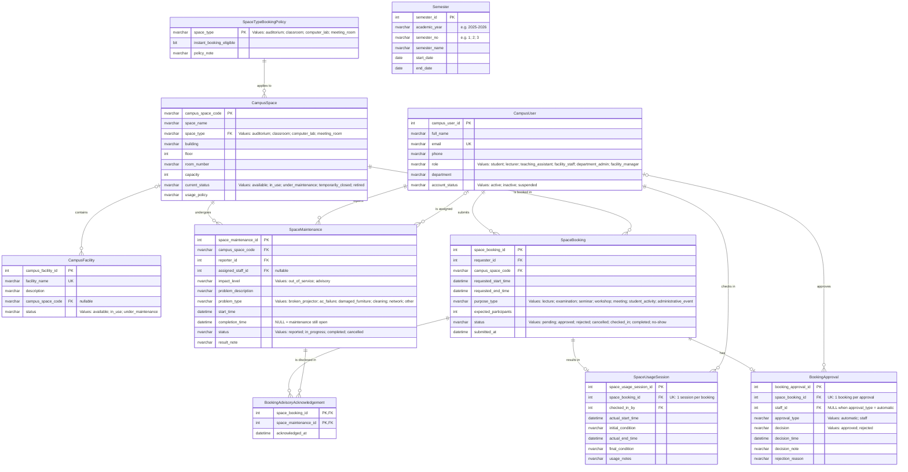
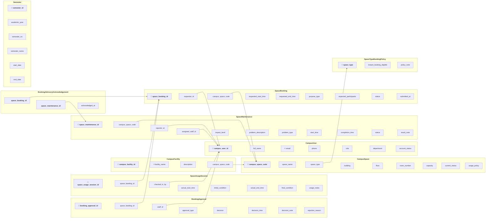

# Updated ERD and Logical Database Design

**Group:** G02

**Phase:** Phase 2 — Design Update (Step 09)

**Task:** Updated ERD and Logical Database Design for the Campus Space Management System

**Generation date:** 2026-07-31

---

## 1. Design Scope and Source Baseline

This artifact updates the Phase 1 conceptual ERD and relational schema of the Campus Space Management System so the design supports the Phase 2 requirements: maintenance impact levels, advisory notification and acknowledgement records, instant and staff-approved booking paths, prevention of conflicting approved bookings under concurrent operations, and the new reporting needs (in particular identifying bookings affected by maintenance escalation).

**Phase 1 baseline artifacts:**

- `outputs/01-business-req-analysis-G02.md` (entities, relationships, business rules BR-01 … BR-10)
- `outputs/02-erd-design-G02.md` (Phase 1 conceptual ERD)
- `outputs/03-logical-design-G02.md` (Phase 1 relational schema)
- `outputs/04-design-validation-G02.md` (Phase 1 validation)
- `outputs/05-db-definition-G02.sql` (implemented Phase 1 DDL — authoritative for actual column names, key semantics, and constraints)

**Phase 2 requirements driving the changes:**

- `CS486_Project_Phase02(2).md` → `CS486_Project_Phase02.md`, §1.1 maintenance impact levels, §1.2 concurrent booking and approval, §1.3 new reporting needs.
- `new_requirement.md` (`req/new_requirement.md`) — same three change areas, treated as the highest-priority source.

**Analysis input:**

- `outputs/08-requirement-change-analysis-G02.md` (Step 08) — used as an input, validated against the authoritative Phase 2 requirements. Corrections are recorded in Section 2 and Section 5.

**Intentionally deferred to later artifacts:**

- Schema migration DDL (existing data preservation, new column defaults, config seeding) → `10-schema-migration-G02.sql`.
- Concurrency-control implementation (locking scheme, transaction isolation, protected stored procedures, triggers) → `11-concurrency-design-G02.md`, `12-concurrency-implementation-G02.sql`, `13-concurrency-tests-G02/`.
- Sample-data generation (including advisory acknowledgements and escalated maintenance) → `14-data-generator-G02/`.
- Index recommendations → `15-index-tuning-report-G02.md`.
- The four Phase 2 analytical queries → `16-analytical-queries-G02.sql`.

This artifact is a **design artifact**: it defines what the data model must contain and which invariants must be enforced; it does not contain executable migration or concurrency SQL.

---

## 2. Design Decisions and Change Summary

| Design Item | Change Type | Phase 1 Design | Updated Design | Requirement Rationale |
|---|---|---|---|---|
| `SpaceMaintenance.impact_level` | New attribute | No impact concept; any maintenance blocks booking | `NVARCHAR(20) NOT NULL DEFAULT 'out_of_service'`, `CHECK (impact_level IN ('out_of_service','advisory'))` | Phase 2 §1.1 / `new_requirement.md` — two impact levels with different booking behaviour |
| `SpaceMaintenance` open maintenance interval | New constraints | `completion_time` nullable, no interval rule | Interval = `[start_time, completion_time)`; `completion_time IS NULL` means open-ended `[start_time, ∞)`; `CHECK (completion_time IS NULL OR completion_time > start_time)`; `CHECK (status = 'completed' ⇒ completion_time IS NOT NULL)` | Phase 2 §1.1 — temporal overlap between maintenance and booking periods must be well defined, including open-ended maintenance |
| `SpaceMaintenance.impact_level` mutability | Behaviour change | Impact not modelled | `impact_level` may be escalated (advisory → out_of_service) or downgraded while the maintenance record is still open; change is a normal `UPDATE` performed in the maintenance-management transaction | Phase 2 §1.1 — escalation/downgrade while maintenance remains open |
| `BookingAdvisoryAcknowledgement` | New entity (correction of Step 08) | Step 08 proposed `SpaceBooking.advisory_acknowledged BIT` | Normalized associative entity: composite PK `(space_booking_id, space_maintenance_id)` + `acknowledged_at`; one row per advisory disclosed for a booking | Phase 2 §1.1 — acknowledgement must be tied to the specific advisories disclosed, not to an undifferentiated Boolean (instruction §4.2) |
| `BookingApproval.approval_type` | New attribute (correction of Step 08) | Step 08 proposed `SpaceBooking.is_instant_booking BIT`; single staff approval workflow | `NVARCHAR(20) NOT NULL CHECK (approval_type IN ('automatic','staff'))`; the approval record is the single source of truth for how a booking was approved | Phase 2 §1.2 — automatic vs staff approval must be distinguishable and auditable (instruction §4.3) |
| `BookingApproval.staff_id` | Modified | `NOT NULL` | `NULL` allowed; `NOT NULL` when `approval_type='staff'`, `NULL` when `approval_type='automatic'` | Phase 2 §1.2 — automatic approval has no staff member; absence of staff must not violate referential integrity |
| `SpaceTypeBookingPolicy` | New entity (correction of Step 08) | Step 08 assumed instant eligibility for "classrooms and auditoriums" | Configuration relation keyed by `space_type` with `instant_booking_eligible BIT`; eligibility is data, not hard-coded | Phase 2 §1.2 — "selected space types" are not identified in any authoritative project file; eligibility must be modelled generically (instruction §3) |
| `CampusSpace.space_type` | Modified | Plain domain attribute | `FK → SpaceTypeBookingPolicy.space_type`; every space's type must have a policy row | Traceable generic eligibility; config completeness for instant booking |
| `Semester` | New entity | No semester concept | `semester_id PK`, `academic_year`, `semester_no`, `semester_name`, `start_date`, `end_date`, `UK (academic_year, semester_no)` | Phase 2 §1.3 — reports 1 and 2 are defined "for a given semester" |
| BR-01 / BR-12 overlap invariant | Modified + New | Phase 1 trigger checked only `status='approved'` | Invariant covers the approved lifecycle (`approved`, `checked_in`, `completed`, `no-show`) and must hold under concurrent operations for both approval paths; enforced transactionally | Phase 2 §1.2 — no two approved bookings may overlap, regardless of path or concurrency |
| BR-02 / BR-09 | Modified | Any maintenance blocks booking | Only active maintenance with `impact_level='out_of_service'` whose interval overlaps the requested period blocks booking; advisory maintenance never blocks | Phase 2 §1.1 — impact levels |
| BR-11 / BR-13 / BR-14 | New | Not present | Instant booking policy; per-advisory acknowledgement; escalation-affected-booking identification | Phase 2 §1.1, §1.2 |
| `CampusFacility.facility_name` | Consistency correction | Earlier diagrams used `facility_type` with a `UK` marker; implemented DDL uses `facility_name NVARCHAR(100)` with `UNIQUE` | Keep `facility_name` with `UNIQUE` exactly as implemented | Instruction §6.4 — preserve the real key semantics of the Phase 1 DDL; do not re-introduce a global-unique `facility_type` |
| `campus_space_code` data type | Consistency correction | Phase 1 ERD (doc 02) declared `int campus_space_code` on `CampusFacility` | `NVARCHAR(20)` in every diagram and definition | Instruction §6.3 — `campus_space_code` must be `NVARCHAR` consistently |
| Crow's-foot optionality of R3, R5, R10 | Consistency correction | Phase 1 ERD drew `||` on the parent side although the FK columns are nullable in the DDL | Accurate optionality: `|o` where the FK is nullable | Instruction §3.1 — accurate Crow's Foot cardinalities and optionality must match the FKs |

**Corrections and refinements made to Step 08** (`outputs/08-requirement-change-analysis-G02.md`):

1. **Step 08 §2 (SpaceBooking):** proposed `advisory_acknowledged BIT` and `is_instant_booking BIT` on `SpaceBooking`. **Corrected:** the acknowledgement is moved to the associative entity `BookingAdvisoryAcknowledgement` (a single Boolean cannot preserve which advisories were disclosed when several active advisories exist — instruction §4.2). The instant-booking marker is moved to `BookingApproval.approval_type` (a column on `SpaceBooking` would be a second, contradictable source of truth — instruction §4.3).
2. **Step 08 §4 (BR-11):** assumed instant eligibility for "classrooms and auditoriums". **Corrected:** no authoritative Phase 2 file identifies the selected space types; eligibility is now generic configuration data in `SpaceTypeBookingPolicy` (instruction §3).
3. **Step 08 §3 (Relationships):** stated "No new relationships between entities are introduced." **Corrected:** new relationships R11 (booking ↔ acknowledgement), R12 (maintenance ↔ acknowledgement), and R13 (space-type policy ↔ space) are required to support the associative acknowledgement and the generic eligibility design.
4. **Step 08 §4 (BR-13):** tied acknowledgement to a booking-level flag. **Corrected:** acknowledgement is a set of per-advisory records captured as a snapshot at submission time (instruction §4.2).

---

## 3. Updated Conceptual ERD

### 3.1. Mermaid ER Diagram



### 3.2. Entity Change Descriptions

#### SpaceMaintenance (modified)

- **Purpose:** unchanged — a maintenance record for a campus space; now also distinguishes whether the space is unusable or merely has an advisory.
- **Added attribute:** `impact_level NVARCHAR(20) NOT NULL DEFAULT 'out_of_service'`, `CHECK (impact_level IN ('out_of_service','advisory'))`.
  - `out_of_service`: the space cannot be booked for any period overlapping the maintenance interval (Phase 1 behaviour).
  - `advisory`: the space remains bookable; the requester must be informed and the acknowledgement recorded.
- **Why required:** Phase 2 §1.1 refines the blanket "under maintenance = unavailable" rule into two impact levels.
- **Open maintenance interval (instruction §4.1):** the maintenance interval is `[start_time, completion_time)`.
  - `completion_time IS NULL` ⇒ open-ended interval `[start_time, ∞)` — the maintenance is still open and its impact applies indefinitely from `start_time`.
  - `completion_time IS NOT NULL` ⇒ closed interval `[start_time, completion_time)`.
  - `status` remains a workflow flag (`reported`, `in_progress`, `completed`, `cancelled`). Booking-conflict and reporting logic use the **temporal interval** of active records (`status IN ('reported','in_progress')`) with `impact_level='out_of_service'`, not `CampusSpace.current_status`.
  - Declarable row-level checks: `CHECK (completion_time IS NULL OR completion_time > start_time)`, `CHECK (status = 'completed' ⇒ completion_time IS NOT NULL)`, and `CHECK (status IN ('reported','in_progress') ⇒ completion_time IS NULL)`.
- **Participation and cardinality:** a space can have several active maintenance records at the same time with different impact levels — naturally supported because each record is its own row with its own interval and impact level; no cross-row constraint restricts it (Phase 2 §1.1 explicitly allows it). R8 1:N, R9 1:N, R10 0..1:N.
- **Historical/audit behaviour:** records are never hard-deleted (BR-10). Escalation/downgrade is a normal `UPDATE` of `impact_level` while the record is open; the current value is what drives booking conflicts and the escalation report. A dedicated impact-history relation is not added (see Section 10). Acknowledgement rows referencing this record remain valid after any edit because they reference `space_maintenance_id`, not the impact value.

#### BookingApproval (modified)

- **Purpose:** the single decision record for a booking; now represents both approval paths without losing auditability.
- **Added attribute:** `approval_type NVARCHAR(20) NOT NULL`, `CHECK (approval_type IN ('automatic','staff'))`.
  - `automatic`: instant booking — approved at submission time, `staff_id` is `NULL`.
  - `staff`: the existing staff approval workflow — `staff_id` is required.
- **Modified attribute:** `staff_id` changed from `NOT NULL` to nullable with the consistency check `CHECK ((approval_type = 'automatic' AND staff_id IS NULL) OR (approval_type = 'staff' AND staff_id IS NOT NULL))`. Referential integrity to `CampusUser` is preserved by keeping the FK; a `NULL` value legally represents "no staff member" without a dummy user.
- **Unchanged attributes:** `booking_approval_id`, `space_booking_id` (`UNIQUE`, 1:1 with `SpaceBooking`), `decision`, `decision_time` (when approval occurred — for automatic approvals this is the submission-time system timestamp), `decision_note`, `rejection_reason` (BR-04).
- **Why required:** Phase 2 §1.2 — automatic approval at submission time and staff approval must coexist, and it must be determinable *how*, *when*, and *by whom* a booking was approved. Keeping both paths in `BookingApproval` (instead of a bit on `SpaceBooking`) gives one auditable source of truth and avoids contradictable flags.
- **Consistency rule (single source of truth):** `SpaceBooking.status` and `BookingApproval.decision` must agree:
  - `SpaceBooking.status = 'approved'` ⟺ a `BookingApproval` row with `decision='approved'` exists;
  - `SpaceBooking.status = 'rejected'` ⟺ a `BookingApproval` row with `decision='rejected'` exists;
  - `SpaceBooking.status = 'pending'` ⟹ no `BookingApproval` row exists yet.
  - This is a cross-row rule and is enforced by trigger/protected stored procedure (BR-03), not by `CHECK`.
- **Participation and cardinality:** R4 1:0..1 (unchanged); R5 now 0..1:N because an automatic approval has no staff member.
- **Historical/audit behaviour:** no hard deletes (BR-10); the decision record persists even after the booking status advances.

#### CampusSpace (modified)

- **Purpose:** unchanged — a bookable physical space.
- **Added constraint:** `space_type` becomes a foreign key `FK → SpaceTypeBookingPolicy.space_type`. `space_type` remains `NOT NULL` with the same domain values (`auditorium`, `classroom`, `computer_lab`, `meeting_room`).
- **Why required:** makes instant-booking eligibility traceable and complete — every space type must have a policy row, so eligibility cannot be silently undefined.
- **Participation and cardinality:** R13 — `SpaceTypeBookingPolicy` 1:N `CampusSpace` (each space has exactly one policy through its type; a policy applies to many spaces).
- **Historical/audit behaviour:** unchanged; `current_status` remains a convenience current-state attribute and is *not* the source of temporal maintenance availability (instruction §6.5).

#### CampusFacility (unchanged, naming corrected)

- **Purpose and structure:** unchanged from the Phase 1 DDL. The implemented column is `facility_name NVARCHAR(100)` with a `UNIQUE` constraint and nullable `campus_space_code NVARCHAR(20)`. Earlier diagrams labelled this attribute `facility_type` and declared an `INT` campus_space_code; the updated design uses the implemented names and types (`facility_name`, `NVARCHAR(20)` `campus_space_code`) so the diagrams match `05-db-definition-G02.sql`. The Phase 1 key semantics (`UNIQUE (facility_name)`) are preserved.
- **Participation and cardinality:** R3 1:0..N — a facility may be unassigned to a space (`campus_space_code` nullable).

#### SpaceBooking (unchanged)

- **Purpose and attributes:** unchanged — no new columns are required. Instant booking, acknowledgement, and semester membership are all represented elsewhere (`BookingApproval.approval_type`, `BookingAdvisoryAcknowledgement`, and derived-by-period respectively). `status` participates in the overlap invariant and in the status↔decision consistency rule.

#### SpaceUsageSession (unchanged)

- **Purpose, attributes, keys, participation (R6 1:0..1, R7 1:N):** unchanged from Phase 1.

#### CampusUser (unchanged)

- **Purpose, attributes, keys, relationships (R1, R5, R7, R9, R10):** unchanged from Phase 1.

#### BookingAdvisoryAcknowledgement (new)

- **Purpose:** records, per booking, each advisory maintenance record that was disclosed to and acknowledged by the requester at submission time.
- **Attributes:** `space_booking_id INT NOT NULL`, `space_maintenance_id INT NOT NULL` — composite primary key; `acknowledged_at DATETIME2 NOT NULL DEFAULT GETDATE()`.
- **Why required:** Phase 2 §1.1 — the system must notify the requester of *all* active advisories and record the acknowledgement. Multiple active advisories may exist, so acknowledgement must be tied to each specific advisory (instruction §4.2, §6.6).
- **Uniqueness rule:** the composite PK prevents duplicate acknowledgement of the same advisory for the same booking.
- **Acknowledging requester:** the acknowledgement is performed by the requester when submitting the booking, so it is safely derivable from `SpaceBooking.requester_id`; no separate `acknowledged_by` column is added (instruction §4.2).
- **Snapshot semantics:** the rows are a snapshot of the advisories that were active at submission time. They reference `space_maintenance_id`, so they remain valid even if the maintenance record is later completed, escalated, downgraded, or edited (instruction §6.7). Escalation/downgrade never deletes these rows.
- **Participation and cardinality:** R11 — `SpaceBooking` 1:N `BookingAdvisoryAcknowledgement` (a booking has 0..N acknowledgements, one per disclosed advisory); R12 — `SpaceMaintenance` 1:N `BookingAdvisoryAcknowledgement` (a maintenance record may be acknowledged by many bookings).
- **Historical/audit behaviour:** rows are never deleted; they form an immutable disclosure-and-acknowledgement record per booking.

#### SpaceTypeBookingPolicy (new)

- **Purpose:** configuration relation that declares, per space type, whether instant (automatic) booking is eligible.
- **Attributes:** `space_type NVARCHAR(30) PK` (same domain as `CampusSpace.space_type`), `instant_booking_eligible BIT NOT NULL DEFAULT 0`, `policy_note NVARCHAR(MAX) NULL`.
- **Why required:** Phase 2 §1.2 — "selected space types" are not identified by any authoritative file; modelling eligibility as data keeps the schema stable and lets the Facility Manager enable/disable instant booking per type (instruction §3, §4.3).
- **Participation and cardinality:** R13 — `SpaceTypeBookingPolicy` 1:N `CampusSpace`.
- **Historical/audit behaviour:** configuration table; changes are policy edits, not historical events. Default `0` means "not eligible → staff approval" until the manager opts in.

#### Semester (new)

- **Purpose:** reference relation defining academic semesters, required because Phase 2 reports 1 and 2 are parameterised "for a given semester".
- **Attributes:** `semester_id INT PK`, `academic_year NVARCHAR(9) NOT NULL` (e.g., `2025-2026`), `semester_no NVARCHAR(20) NOT NULL` (e.g., `1`, `2`, `3`), `semester_name NVARCHAR(100) NOT NULL`, `start_date DATE NOT NULL`, `end_date DATE NOT NULL`; `UNIQUE (academic_year, semester_no)`; `CHECK (end_date > start_date)`.
- **Why required:** no Phase 1 element defines a semester; the reports need a parameterizable period.
- **Relationship:** none by FK. A booking is assigned to a semester by temporal overlap of its requested interval with `Semester.start_date`/`end_date`. No redundant `semester_id` FK is placed on `SpaceBooking` (instruction §6.9 — avoid storing redundant derived data; the generator and queries derive membership).
- **Historical/audit behaviour:** reference data; semesters are created once and kept.

### 3.3. Relationship Summary

| ID | Entity A | Relationship | Entity B | Cardinality | Participation | Change Status | Rationale |
|---|---|---|---|---|---|---|---|
| R1 | CampusUser | submits | SpaceBooking | 1:N | CampusUser: optional, SpaceBooking: mandatory | Unchanged | Phase 1 retained |
| R2 | CampusSpace | is booked in | SpaceBooking | 1:N | CampusSpace: optional, SpaceBooking: mandatory | Unchanged | Phase 1 retained |
| R3 | CampusSpace | contains | CampusFacility | 1:0..N | Both optional | Modified (optionality corrected) | DDL allows `CampusFacility.campus_space_code` to be NULL |
| R4 | SpaceBooking | has | BookingApproval | 1:0..1 | SpaceBooking: optional, BookingApproval: mandatory | Unchanged (semantics extended) | Approval now covers both paths |
| R5 | CampusUser (staff) | approves | BookingApproval | 0..1:N | CampusUser: optional, BookingApproval: optional | Modified (optionality corrected) | Automatic approval has no staff (`staff_id` nullable) |
| R6 | SpaceBooking | results in | SpaceUsageSession | 1:0..1 | SpaceBooking: optional, SpaceUsageSession: mandatory | Unchanged | Phase 1 retained |
| R7 | CampusUser (staff) | checks in | SpaceUsageSession | 1:N | CampusUser: optional, SpaceUsageSession: mandatory | Unchanged | Phase 1 retained |
| R8 | CampusSpace | undergoes | SpaceMaintenance | 1:N | CampusSpace: optional, SpaceMaintenance: mandatory | Unchanged (behaviour refined) | Impact level decides blocking vs advisory |
| R9 | CampusUser (reporter) | reports | SpaceMaintenance | 1:N | CampusUser: optional, SpaceMaintenance: mandatory | Unchanged | Phase 1 retained |
| R10 | CampusUser (assignee) | is assigned | SpaceMaintenance | 0..1:N | CampusUser: optional, SpaceMaintenance: optional | Modified (optionality corrected) | DDL allows `assigned_staff_id` to be NULL |
| R11 | SpaceBooking | discloses | BookingAdvisoryAcknowledgement | 1:N | SpaceBooking: optional, BookingAdvisoryAcknowledgement: mandatory | **New** | Per-booking disclosure snapshot (Phase 2 §1.1) |
| R12 | SpaceMaintenance | is disclosed in | BookingAdvisoryAcknowledgement | 1:N | SpaceMaintenance: optional, BookingAdvisoryAcknowledgement: mandatory | **New** | Per-advisory traceability (Phase 2 §1.1) |
| R13 | SpaceTypeBookingPolicy | applies to | CampusSpace | 1:N | SpaceTypeBookingPolicy: optional, CampusSpace: mandatory | **New** | Generic instant-booking eligibility (Phase 2 §1.2) |

Relationship IDs R1–R10 are retained from the Phase 1 ERD (`02-erd-design-G02.md` §3); R11–R13 are new sequential IDs.

---

## 4. Updated Relational Schema

### 4.1. Relational Schema Diagram

**Key Notation:**

- `🔑` = Primary Key (PK)
- `🔗` = Foreign Key (FK)
- `⭐` = Candidate Key / Unique Key (UK)

**Text Formatting:**

- **Bold** text = Primary Key attribute
- *Italic* text = Foreign Key attribute
- ***Bold italic*** text = Attribute that is both PK and FK



### 4.2. Relation Definitions

Unchanged relations retain their Phase 1 definitions exactly as implemented in `05-db-definition-G02.sql`: `CampusUser`, `CampusSpace` (except the new FK in §3.2), `CampusFacility` (attribute named `facility_name` per the DDL), `SpaceBooking`, `SpaceUsageSession`. Definitions below cover every changed or new relation.

#### CampusSpace (modified — new FK only)

```
CampusSpace(campus_space_code PK, space_name, space_type FK→SpaceTypeBookingPolicy.space_type, building, floor, room_number, capacity, current_status, usage_policy)
```

| Attribute | SQL Server Data Type | Nullability | Key/Constraint | Default | References / Rule |
|---|---|---|---|---|---|
| campus_space_code | NVARCHAR(20) | NOT NULL | PK | — | — |
| space_name | NVARCHAR(100) | NOT NULL | — | — | — |
| space_type | NVARCHAR(30) | NOT NULL | FK | — | `SpaceTypeBookingPolicy.space_type`; CHECK domain as Phase 1 |
| building | NVARCHAR(100) | NOT NULL | — | — | UK (building, floor, room_number) as Phase 1 |
| floor | INT | NOT NULL | — | — | — |
| room_number | NVARCHAR(20) | NOT NULL | — | — | — |
| capacity | INT | NOT NULL | CHECK | — | `capacity > 0` |
| current_status | NVARCHAR(30) | NOT NULL | CHECK | 'available' | domain as Phase 1 |
| usage_policy | NVARCHAR(MAX) | NULL | — | — | — |

#### SpaceMaintenance (modified)

```
SpaceMaintenance(space_maintenance_id PK, campus_space_code FK→CampusSpace.campus_space_code, reporter_id FK→CampusUser.campus_user_id, assigned_staff_id FK→CampusUser.campus_user_id, impact_level, problem_description, problem_type, start_time, completion_time, status, result_note)
```

| Attribute | SQL Server Data Type | Nullability | Key/Constraint | Default | References / Rule |
|---|---|---|---|---|---|
| space_maintenance_id | INT | NOT NULL | PK | IDENTITY(1,1) | — |
| campus_space_code | NVARCHAR(20) | NOT NULL | FK | — | `CampusSpace.campus_space_code` |
| reporter_id | INT | NOT NULL | FK | — | `CampusUser.campus_user_id` |
| assigned_staff_id | INT | NULL | FK | — | `CampusUser.campus_user_id` |
| impact_level | NVARCHAR(20) | NOT NULL | **CHECK** | 'out_of_service' | `CHECK (impact_level IN ('out_of_service','advisory'))` — **new** |
| problem_description | NVARCHAR(MAX) | NOT NULL | — | — | — |
| problem_type | NVARCHAR(30) | NOT NULL | CHECK | — | domain as Phase 1 |
| start_time | DATETIME2 | NOT NULL | — | GETDATE() | — |
| completion_time | DATETIME2 | NULL | **CHECK** | — | **new:** `CHECK (completion_time IS NULL OR completion_time > start_time)`; `CHECK (status = 'completed' ⇒ completion_time IS NOT NULL)`; `CHECK (status IN ('reported','in_progress') ⇒ completion_time IS NULL)` |
| status | NVARCHAR(20) | NOT NULL | CHECK | 'reported' | domain as Phase 1 |
| result_note | NVARCHAR(MAX) | NULL | — | — | — |

#### BookingApproval (modified)

```
BookingApproval(booking_approval_id PK, space_booking_id FK→SpaceBooking.space_booking_id UK, staff_id FK→CampusUser.campus_user_id, approval_type, decision, decision_time, decision_note, rejection_reason)
```

| Attribute | SQL Server Data Type | Nullability | Key/Constraint | Default | References / Rule |
|---|---|---|---|---|---|
| booking_approval_id | INT | NOT NULL | PK | IDENTITY(1,1) | — |
| space_booking_id | INT | NOT NULL | FK + UK | — | `SpaceBooking.space_booking_id`; UNIQUE keeps 1:1 (R4) |
| staff_id | INT | **NULL** | FK | — | `CampusUser.campus_user_id`; **changed from NOT NULL** — NULL only when `approval_type='automatic'` |
| approval_type | NVARCHAR(20) | NOT NULL | **CHECK** | — | **new:** `CHECK (approval_type IN ('automatic','staff'))` |
| decision | NVARCHAR(10) | NOT NULL | CHECK | — | `CHECK (decision IN ('approved','rejected'))` |
| decision_time | DATETIME2 | NOT NULL | — | GETDATE() | approval moment; automatic = submission-time system timestamp |
| decision_note | NVARCHAR(MAX) | NULL | — | — | — |
| rejection_reason | NVARCHAR(MAX) | NULL | CHECK | — | BR-04 as Phase 1 |

**New cross-attribute checks (row-level, SQL Server `CHECK` can enforce them):**

- `CHECK ((approval_type = 'automatic' AND staff_id IS NULL) OR (approval_type = 'staff' AND staff_id IS NOT NULL))`
- BR-04 preserved: `CHECK ((decision = 'rejected' AND rejection_reason IS NOT NULL) OR (decision = 'approved'))`

#### BookingAdvisoryAcknowledgement (new)

```
BookingAdvisoryAcknowledgement(space_booking_id FK→SpaceBooking.space_booking_id PK, space_maintenance_id FK→SpaceMaintenance.space_maintenance_id PK, acknowledged_at)
```

| Attribute | SQL Server Data Type | Nullability | Key/Constraint | Default | References / Rule |
|---|---|---|---|---|---|
| space_booking_id | INT | NOT NULL | **Composite PK + FK** | — | `SpaceBooking.space_booking_id` |
| space_maintenance_id | INT | NOT NULL | **Composite PK + FK** | — | `SpaceMaintenance.space_maintenance_id` |
| acknowledged_at | DATETIME2 | NOT NULL | — | GETDATE() | when the requester acknowledged |

Composite PK `(space_booking_id, space_maintenance_id)` enforces the uniqueness rule "one acknowledgement per advisory per booking" (BR-13). No `acknowledged_by` column: the acknowledging requester is safely derivable from `SpaceBooking.requester_id`.

#### SpaceTypeBookingPolicy (new)

```
SpaceTypeBookingPolicy(space_type PK, instant_booking_eligible, policy_note)
```

| Attribute | SQL Server Data Type | Nullability | Key/Constraint | Default | References / Rule |
|---|---|---|---|---|---|
| space_type | NVARCHAR(30) | NOT NULL | PK + CHECK | — | `CHECK (space_type IN ('auditorium','classroom','computer_lab','meeting_room'))` |
| instant_booking_eligible | BIT | NOT NULL | — | 0 | configuration flag — not eligible ⇒ staff approval |
| policy_note | NVARCHAR(MAX) | NULL | — | — | free-text policy description |

#### Semester (new)

```
Semester(semester_id PK, academic_year, semester_no, semester_name, start_date, end_date, UK(academic_year, semester_no))
```

| Attribute | SQL Server Data Type | Nullability | Key/Constraint | Default | References / Rule |
|---|---|---|---|---|---|
| semester_id | INT | NOT NULL | PK | IDENTITY(1,1) | — |
| academic_year | NVARCHAR(9) | NOT NULL | — | — | e.g., `2025-2026` |
| semester_no | NVARCHAR(20) | NOT NULL | — | — | e.g., `1`, `2`, `3` |
| semester_name | NVARCHAR(100) | NOT NULL | — | — | display name |
| start_date | DATE | NOT NULL | CHECK | — | — |
| end_date | DATE | NOT NULL | CHECK | — | `CHECK (end_date > start_date)` |

Unique key `(academic_year, semester_no)` prevents duplicate semesters. No FK links `Semester` to `SpaceBooking`; membership is derived by temporal overlap of the booking interval with `[start_date, end_date]`.

### 4.3. Key and Integrity Constraint Summary

**New primary keys**

| Relation | PK |
|---|---|
| BookingAdvisoryAcknowledgement | Composite `(space_booking_id, space_maintenance_id)` |
| SpaceTypeBookingPolicy | `space_type` |
| Semester | `semester_id` |

**New foreign keys**

| FK | Target | Note |
|---|---|---|
| `CampusSpace.space_type` | `SpaceTypeBookingPolicy.space_type` | R13 |
| `BookingAdvisoryAcknowledgement.space_booking_id` | `SpaceBooking.space_booking_id` | R11, part of composite PK |
| `BookingAdvisoryAcknowledgement.space_maintenance_id` | `SpaceMaintenance.space_maintenance_id` | R12, part of composite PK |

Modified FK: `BookingApproval.staff_id → CampusUser.campus_user_id` changed from `NOT NULL` to nullable (automatic approvals); all other Phase 1 FKs unchanged.

**New candidate/unique keys**

| Relation | UK | Purpose |
|---|---|---|
| Semester | `(academic_year, semester_no)` | one semester per academic year + number |
| BookingAdvisoryAcknowledgement | composite PK serves as UK | one acknowledgement per (booking, advisory) |

**New CHECK / NOT NULL / DEFAULT constraints**

- `SpaceMaintenance.impact_level` `NOT NULL DEFAULT 'out_of_service'` with `CHECK IN ('out_of_service','advisory')`.
- `SpaceMaintenance` interval checks: `completion_time IS NULL OR completion_time > start_time`; `status='completed' ⇒ completion_time IS NOT NULL`; `status IN ('reported','in_progress') ⇒ completion_time IS NULL`.
- `BookingApproval.approval_type` `NOT NULL` with `CHECK IN ('automatic','staff')`.
- `BookingApproval` approval/staff consistency: `(approval_type='automatic' AND staff_id IS NULL) OR (approval_type='staff' AND staff_id IS NOT NULL)`.
- `Semester.end_date > start_date`.
- `BookingAdvisoryAcknowledgement.acknowledged_at` `NOT NULL DEFAULT GETDATE()`.
- `SpaceTypeBookingPolicy.instant_booking_eligible` `NOT NULL DEFAULT 0`.

**Cross-row / cross-table rules requiring transaction logic, trigger, or stored procedure (not `CHECK`/`UNIQUE` — SQL Server `CHECK` cannot query another row or table):**

- BR-01 / BR-12 — time-range overlap of approved bookings for the same space (transactional stored procedure, Steps 11–13).
- BR-02 / BR-09 — active out-of-service maintenance interval overlap at booking/approval time (transactional stored procedure).
- BR-03 — status-transition flow and the `SpaceBooking.status` ↔ `BookingApproval.decision` consistency rule (triggers / protected stored procedure).
- BR-11 — instant eligibility resolution + automatic approval record creation (protected stored procedure / application policy).
- BR-13 — capturing the advisory snapshot into `BookingAdvisoryAcknowledgement` at submission (protected stored procedure).
- BR-14 — escalation-affected-booking identification (derived query).

**Recommended indexes (recommendations only, for `15-index-tuning-report-G02.md` — a normal index alone is not a concurrency guarantee):**

- `SpaceBooking (campus_space_code, requested_start_time, requested_end_time)` with `status` — supports the overlap invariant check and reports 1/2/4.
- `SpaceMaintenance (campus_space_code, impact_level, start_time, completion_time)` — supports the out-of-service check and report 4.
- `CampusFacility (campus_space_code, facility_name)` — supports the room-finder facility matching (report 3).
- `SpaceBooking (requested_start_time)` — supports semester-range joins.

---

## 5. Updated Business Rule Enforcement Map

Rule identifiers follow Phase 1 (`01-business-req-analysis-G02.md` §6, `03-logical-design-G02.md` §2) and Step 08 (`08-requirement-change-analysis-G02.md` §4), with corrections applied.

| Business Rule ID | Updated Rule | Status | Enforcement Mechanism | Relations | Attributes | Design Notes / Deferred Artifact |
|---|---|---|---|---|---|---|
| BR-01 | For the same campus space, no two bookings in the approved lifecycle (`status IN ('approved','checked_in','completed','no-show')`) may have overlapping requested time intervals. Applies to both instant and staff approval paths. | Modified | Transactional Stored Procedure | SpaceBooking | campus_space_code, requested_start_time, requested_end_time, status | Half-open overlap rule `existing_start < requested_end AND requested_start < existing_end`. Cannot be a `CHECK`/`UNIQUE`. Replaces Phase 1 trigger TRG-01. Deferred to artifacts 11–13. |
| BR-02 | A space that is `temporarily_closed` or `retired` cannot be booked. A space with an active maintenance interval (`impact_level='out_of_service'`) overlapping the requested period cannot be approved. Advisory maintenance does not block booking. | Modified | Transactional Stored Procedure | CampusSpace, SpaceMaintenance, SpaceBooking | current_status, impact_level, start_time, completion_time, status | Check at submission and re-checked at approval inside the protected transaction. Deferred to artifacts 11–13. |
| BR-03 | Booking status flows `pending → approved/rejected/cancelled → checked_in → completed/no-show`, and `SpaceBooking.status` is consistent with `BookingApproval.decision` (`approved` ⟺ decision `approved`; `rejected` ⟺ decision `rejected`; `pending` ⟹ no approval row). | Modified | Trigger | SpaceBooking, BookingApproval | status, decision | Cross-row consistency cannot be a `CHECK`. Extends Phase 1 TRG-02. Deferred to artifacts 11–13. |
| BR-04 | `rejection_reason` is required when `decision='rejected'`. | Unchanged | CHECK | BookingApproval | decision, rejection_reason | Phase 1 CHECK preserved. |
| BR-05 | A staff approval must be made by a facility staff member or facility manager. Automatic approvals have no staff member. | Modified | CHECK + Application/Policy Logic | BookingApproval, CampusUser | approval_type, staff_id, role | `CHECK ((approval_type='automatic' AND staff_id IS NULL) OR (approval_type='staff' AND staff_id IS NOT NULL))`; role check is application logic. |
| BR-06 | Check-in must be performed by facility staff. | Unchanged | Application/Policy Logic | SpaceUsageSession, CampusUser | checked_in_by, role | Phase 1 behaviour preserved. |
| BR-07 | `expected_participants` must not exceed space capacity. | Unchanged | CHECK + Trigger | SpaceBooking, CampusSpace | expected_participants, capacity | Cross-table check via trigger (Phase 1 TRG-03). |
| BR-08 | `requested_start_time` must be before `requested_end_time`. | Unchanged | CHECK | SpaceBooking | requested_start_time, requested_end_time | Phase 1 CHECK preserved. |
| BR-09 | Only active maintenance with `impact_level='out_of_service'` whose interval overlaps the requested period prevents booking; advisory maintenance never blocks. Maintenance status alone is not the deciding signal. | Modified | Transactional Stored Procedure | SpaceMaintenance, SpaceBooking | impact_level, start_time, completion_time, status | Supersedes Phase 1 "status `in_progress` prevents booking" rule. Same enforcement as BR-02. Deferred to artifacts 11–13. |
| BR-10 | Historical records of bookings, maintenance, and acknowledgements must be preserved (no hard deletes). | Unchanged | Application/Policy Logic | All relations | N/A | `ON DELETE NO ACTION` preserved; acknowledgement rows are immutable. |
| BR-11 | For space types with `instant_booking_eligible = 1` in `SpaceTypeBookingPolicy`, requests satisfying the space's `usage_policy` are auto-approved at submission (`approval_type='automatic'`, `staff_id NULL`, `status='approved'`). All other requests go to staff approval. | New (corrected) | Application/Policy Logic + Transactional Stored Procedure | SpaceTypeBookingPolicy, CampusSpace, SpaceBooking, BookingApproval | space_type, instant_booking_eligible, usage_policy, approval_type, status | Step 08's "classrooms/auditoriums" assumption removed — eligibility is configuration data. Instant path writes the approval record in the same transaction. Deferred to artifacts 10–13. |
| BR-12 | No two approved bookings may overlap for the same space, regardless of approval path, even under concurrent operations by multiple users/staff. | New | Transactional Stored Procedure | SpaceBooking | campus_space_code, requested_start_time, requested_end_time, status | Same protected invariant as BR-01; both approval paths invoke it. Deferred to artifacts 11–13. |
| BR-13 | When a booking is submitted for a space with active advisory maintenance records, the requester is notified of every active advisory and one acknowledgement per advisory is recorded in `BookingAdvisoryAcknowledgement` before the booking is created. | New (corrected) | Composite Key (UNIQUE) + Transactional Stored Procedure | SpaceBooking, SpaceMaintenance, BookingAdvisoryAcknowledgement | space_booking_id, space_maintenance_id, acknowledged_at | Composite PK enforces one ack per (booking, advisory). Snapshot captured at submission. Deferred to artifacts 10–13. |
| BR-14 | When a maintenance record is escalated from `advisory` to `out_of_service`, approved bookings whose intervals overlap its maintenance interval are identified so staff can contact requesters. Bookings are **not** automatically cancelled. | New | Derived Query | SpaceMaintenance, SpaceBooking | impact_level, start_time, completion_time, campus_space_code, requested_start_time, requested_end_time, status | Report 4; derived dynamically from intervals; results are not persisted. Deferred to artifact 16. |

---

## 6. Concurrency-Sensitive Integrity Requirements

**The shared invariant.** For a given `campus_space_code`, no two bookings in the approved lifecycle may have overlapping requested intervals, and a booking may not be approved while an active out-of-service maintenance interval for the same space overlaps the requested period. Participating attributes: `SpaceBooking.campus_space_code`, `requested_start_time`, `requested_end_time`, `status`; `SpaceMaintenance.impact_level`, `start_time`, `completion_time`, `status`.

**Overlap rule.** Intervals are half-open `[start, end)`; two intervals overlap iff `existing_start < requested_end AND requested_start < existing_end`. Touching intervals (`end1 = start2`) do not overlap.

**Why a normal constraint is insufficient.** Ordinary `CHECK` and `UNIQUE` constraints in SQL Server cannot express general time-range overlap across rows, and a conventional index does not prevent two transactions from both reading "no conflict" and both writing an approved booking (phantom reads / race). The invariant therefore requires transactional enforcement — a shared protected stored procedure (with appropriate locking/`UPDLOCK`, `HOLDLOCK` range scan or `sp_getapplock` per space, executed under an appropriate isolation level) that all approval paths call. The concrete locking scheme is designed and implemented in artifacts 11–13; this artifact only exposes the data and the invariant.

**Approval-path unification.** Instant booking, staff approval, and maintenance escalation all serialize on the same per-space data boundary, so no path can bypass the invariant.

**Data access boundaries that later concurrency design must lock or serialize:**

1. `SpaceBooking` rows in the approved lifecycle for the target `campus_space_code` (overlap check target).
2. Active `SpaceMaintenance` rows (`status IN ('reported','in_progress')`) for the target `campus_space_code` with `impact_level='out_of_service'` (BR-02/BR-09 check).
3. The `CampusSpace` row (current status/policy reference).
4. The `SpaceTypeBookingPolicy` row for the space type (instant eligibility — must be read consistently within the transaction).
5. The `BookingAdvisoryAcknowledgement` insert for the new booking (BR-13 snapshot, no duplicates via composite PK).

**Traceability table**

| Concurrency Scenario | Relations/Rows Involved | Integrity Risk | Required Atomic Operation | Deferred To |
|---|---|---|---|---|
| Instant booking vs instant booking (same space, overlapping periods) | `SpaceBooking` rows for the space; `CampusSpace`; `SpaceTypeBookingPolicy` | Both pass the availability check and both are auto-approved → two overlapping approved bookings (BR-01/BR-12 violation) | Serialize per-space check + insert + auto-approval in one transaction (range lock or `sp_getapplock` on the space key) | 11–13 |
| Instant booking vs staff approval | `SpaceBooking`; `BookingApproval` | Instant approval commits overlap that a concurrent staff approval also approves | Both paths invoke the same protected stored procedure under the same per-space lock | 11–13 |
| Staff approval vs staff approval | `SpaceBooking` (pending rows); `BookingApproval` | Two pending overlapping bookings both approved by different staff | Protected approval procedure checks the invariant against approved-lifecycle rows with the per-space range lock | 11–13 |
| Approval (either path) vs maintenance escalation | `SpaceMaintenance` (active rows); `SpaceBooking`; `CampusSpace` | Approval passes the out-of-service check; concurrent escalation to `out_of_service` commits before the approval write → approved booking overlapping out-of-service maintenance (BR-02/BR-09 violation) | Re-check the active out-of-service maintenance interval inside the same transaction that sets `status='approved'`, holding locks on the space's active maintenance rows | 11–13 |
| Escalation-affected-booking identification vs concurrent approvals | `SpaceMaintenance`; `SpaceBooking` | The affected-booking query may miss a booking approved concurrently (phantom row) | Compute affected bookings under a consistent snapshot / serializable scope during the escalation operation | 11–13 |

---

## 7. Reporting Support Matrix

| Report | Relations | Required Attributes | Join/Filter Basis | Supported? | Design Note |
|---|---|---|---|---|---|
| 1. Total approved booking hours of each space for a semester | SpaceBooking, Semester | SpaceBooking: campus_space_code, requested_start_time, requested_end_time, status; Semester: start_date, end_date | Join booking interval to semester period by temporal overlap; filter `status IN ('approved','checked_in','completed','no-show')`; `SUM` of booked durations `GROUP BY campus_space_code` | Yes | Semester membership is derived by period overlap (no redundant FK). Duration = `DATEDIFF` on requested interval; full duration of overlapping bookings counted (assumption, see Section 10). |
| 2. Approved booking count by weekday and hour for a semester | SpaceBooking, Semester | requested_start_time, status | Same semester overlap; `COUNT` grouped by `DATEPART(weekday, requested_start_time)` and `DATEPART(hour, requested_start_time)` | Yes | Weekday value depends on `SET DATEFIRST`; fixed via report logic. Same approved-lifecycle status filter. |
| 3. Available spaces satisfying a required capacity and facility list within a period | CampusSpace, CampusFacility, SpaceMaintenance, SpaceBooking | CampusSpace: campus_space_code, capacity, current_status; CampusFacility: campus_space_code, facility_name, status; SpaceMaintenance: campus_space_code, impact_level, start_time, completion_time, status; SpaceBooking: requested_start_time, requested_end_time, status | `capacity >= required`; every required `facility_name` present with `status='available'`; no approved-lifecycle booking overlap; no active out-of-service maintenance overlap; `current_status NOT IN ('temporarily_closed','retired')` | Yes | Availability is derived from intervals, not from `CampusSpace.current_status` alone (instruction §6.5). |
| 4. Approved bookings affected by maintenance escalation to out-of-service | SpaceMaintenance, SpaceBooking | SpaceMaintenance: campus_space_code, impact_level, start_time, completion_time, status; SpaceBooking: campus_space_code, requested_start_time, requested_end_time, status | For a target escalated record (`impact_level='out_of_service'`, same space): approved-lifecycle bookings whose interval overlaps the maintenance interval | Yes | Derived **dynamically** from maintenance and booking intervals; no persisted affected-booking relation (avoids redundant derived data, instruction §6.9). Escalation never auto-cancels bookings (instruction §6.8). |

---

## 8. Phase 1 to Phase 2 Traceability Matrix

| Requirement / BR | Phase 1 Element | Phase 2 Change | ERD Element | Relation/Constraint | Downstream Artifact |
|---|---|---|---|---|---|
| Phase 2 §1.1 / `new_requirement.md` — maintenance impact levels | `SpaceMaintenance` | Add impact level; out-of-service blocks, advisory does not | `SpaceMaintenance` entity | `SpaceMaintenance.impact_level` + CHECK; BR-02/BR-09 | 10, 11–13 |
| Phase 2 §1.1 — several active maintenance records, different levels | R8 (1:N) | None required — multiple rows per space | R8 | no cross-row constraint (explicitly allowed) | 10, 14 |
| Phase 2 §1.1 — escalation/downgrade while open | `SpaceMaintenance.status` only | `impact_level` mutable while open | `SpaceMaintenance.impact_level` | `UPDATE` via maintenance-management transaction | 10, 11–13 |
| Phase 2 §1.1 — temporal overlap maintenance ↔ booking | `SpaceMaintenance` period | Open maintenance interval semantics | `SpaceMaintenance` | `completion_time IS NULL` = open-ended `[start_time, ∞)`; interval CHECKs | 10, 12 |
| Phase 2 §1.1 — advisory notification + acknowledgement | Step 08: `advisory_acknowledged` BIT | Per-advisory acknowledgement snapshot | `BookingAdvisoryAcknowledgement`, R11, R12 | composite PK `(space_booking_id, space_maintenance_id)`; BR-13 | 10, 12, 14 |
| Phase 2 §1.1 — affected bookings on escalation | (new) | Identification, not auto-cancellation | R8 + SpaceBooking | derived query; BR-14 | 16 |
| Phase 2 §1.2 — selected space types instant booking | Step 08: "classrooms/auditoriums" | Generic eligibility configuration | `SpaceTypeBookingPolicy`, R13 | `CampusSpace.space_type` FK; `instant_booking_eligible`; BR-11 | 10, 11–13, 14 |
| Phase 2 §1.2 — automatic vs staff approval | `BookingApproval` (staff only) | Distinguish approval path | `BookingApproval` | `approval_type` CHECK; BR-05 | 10, 12 |
| Phase 2 §1.2 — approval time / staff / absence of staff | `decision_time`, `staff_id NOT NULL` | `staff_id` nullable for automatic | `BookingApproval` | `(approval_type, staff_id)` consistency CHECK | 12 |
| Phase 2 §1.2 — consistent status vs decision | implicit | Explicit consistency rule | `BookingApproval`, SpaceBooking | BR-03 trigger/SP rule | 12 |
| Phase 2 §1.2 — overlap invariant under concurrency, both paths | Phase 1 TRG-01 | Shared protected invariant | SpaceBooking | BR-01/BR-12 transactional stored procedure | 11–13 |
| Phase 2 §1.3 — report 1 (approved hours per space per semester) | (none) | Semester support | `Semester` entity | `Semester` relation; SpaceBooking interval + status | 14, 16 |
| Phase 2 §1.3 — report 2 (count by weekday/hour) | (none) | — | `Semester`, SpaceBooking | requested_start_time; status | 14, 16 |
| Phase 2 §1.3 — report 3 (available spaces with capacity + facilities) | CampusSpace, CampusFacility | interval-based availability | CampusSpace, CampusFacility, SpaceMaintenance, SpaceBooking | derived query | 16 |
| Phase 2 §1.3 — report 4 (escalation-affected bookings) | (none) | derived, not persisted | SpaceMaintenance, SpaceBooking | BR-14 derived query | 16 |

---

## 9. Design Validation Checklist

| # | Check | Result |
|---|---|---|
| 1 | All Phase 1 entities preserved unless justified | **PASS** — CampusUser, CampusSpace, CampusFacility, SpaceBooking, BookingApproval, SpaceUsageSession, SpaceMaintenance all retained; SpaceBooking/SpaceUsageSession/CampusUser unchanged |
| 2 | All new requirements represented | **PASS** — impact levels, acknowledgement, both approval paths, concurrency invariant, four reports all mapped (Sections 7–8) |
| 3 | Multiple simultaneous advisories supported | **PASS** — multiple `SpaceMaintenance` rows per space with independent intervals/levels; no conflicting constraint |
| 4 | Per-advisory acknowledgement traceability supported | **PASS** — `BookingAdvisoryAcknowledgement` with composite PK `(space_booking_id, space_maintenance_id)` + `acknowledged_at` |
| 5 | Maintenance escalation and affected-booking discovery supported | **PASS** — `impact_level` mutable while open; BR-14 derived query over maintenance and booking intervals |
| 6 | Automatic and staff approval distinguishable and auditable | **PASS** — `BookingApproval.approval_type`, `decision_time`, nullable `staff_id`, status↔decision consistency rule (BR-03, BR-05) |
| 7 | Overlap invariant defined for both approval paths | **PASS** — BR-01/BR-12 shared invariant; all paths use the same protected operation (Section 6) |
| 8 | No unsupported selected-space-type assumption | **PASS** — eligibility is config data in `SpaceTypeBookingPolicy`; Step 08 "classrooms/auditoriums" assumption removed |
| 9 | ERD cardinalities match FKs | **PASS** — R1–R13 each correspond to a declared FK/UK; nullable FKs (R3, R5, R10) shown as optional (`|o`) |
| 10 | Relation definitions match both diagrams | **PASS** — every entity in the ERD has a relation in §4.1/§4.2; attribute names, types, and markers are consistent |
| 11 | All relations satisfy at least 3NF at design level | **PASS** — all attributes depend on the full PK; `BookingAdvisoryAcknowledgement` has no non-key dependency on a proper subset; no transitive dependencies introduced (normalization re-validation is scheduled in Phase 2 report) |
| 12 | Report data requirements are supported | **PASS** — Section 7 covers all four reports with required relations and attributes |
| 13 | No placeholders or unresolved diagram errors remain | **PASS** — all Mermaid node IDs are referenced; every FK edge has a target PK/UK node; no `int campus_space_code` remains |

---

## 10. Assumptions and Deferred Decisions

**Assumptions supported by the project files**

- `CS486_Project_Phase02.md` and `req/new_requirement.md` are the authoritative sources for Phase 2 changes (Source-Priority Rule, instruction §3).
- Existing Phase 1 maintenance records migrate with `impact_level = 'out_of_service'` (the Phase 1 behaviour: maintenance blocks booking), which is why the default is `'out_of_service'`.
- The acknowledging party is the requester acting at submission time; therefore `BookingAdvisoryAcknowledgement` omits `acknowledged_by`, derivable from `SpaceBooking.requester_id`.
- The "approved lifecycle" for the overlap invariant and reports is `status IN ('approved','checked_in','completed','no-show')`.
- A semester is defined by `(academic_year, semester_no)` with a date range; booking-to-semester membership is derived by temporal overlap of the requested interval, so no `semester_id` FK is stored on `SpaceBooking`.

**Policy details not provided by the requirements**

- The specific space types eligible for instant booking are **not identified** in any authoritative file; `SpaceTypeBookingPolicy.instant_booking_eligible` defaults to `0` (staff approval) until the Facility Manager enables it.
- The exact criteria for "requests that satisfy the usage policy" are not specified; compliance evaluation is application logic over the free-text `CampusSpace.usage_policy`.
- Whether report 1 hours should be prorated at semester boundaries is a report-logic choice; the assumption is to count the full requested duration of approved bookings overlapping the semester.
- The weekday definition for report 2 depends on `SET DATEFIRST`; fixed in report logic, not in the schema.
- Whether a `semester_no` is a summer term (e.g., `3`) is not constrained; stored as `NVARCHAR` without a restrictive CHECK.

**Implementation choices deferred to artifacts 10–16**

- Schema migration DDL, default/backfill strategy, and seeding of `SpaceTypeBookingPolicy` and `Semester` → artifact 10.
- Locking scheme (range scan with `UPDLOCK`/`HOLDLOCK`, `sp_getapplock`, isolation level) for the overlap invariant and approval paths → artifacts 11–13.
- Data generator coverage (≥100,000 bookings, advisories, escalations, acknowledgements, cancellations, no-shows) → artifact 14.
- Index strategy (Section 4.3 recommendations) and execution-plan comparisons → artifact 15.
- Analytical SQL for the four reports → artifact 16.
- Re-validation of the updated schema against 3NF/BCNF with explicit functional dependencies → Phase 2 report / normalization validation step.
- Whether a dedicated `SpaceMaintenanceImpactHistory` relation is needed for audit of impact-level changes → not required by the Phase 2 requirements; only the current `impact_level` drives booking conflicts and report 4.
