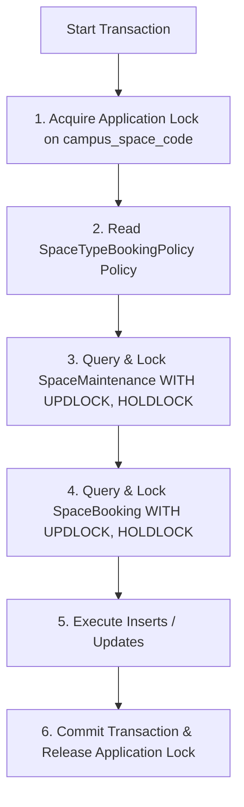
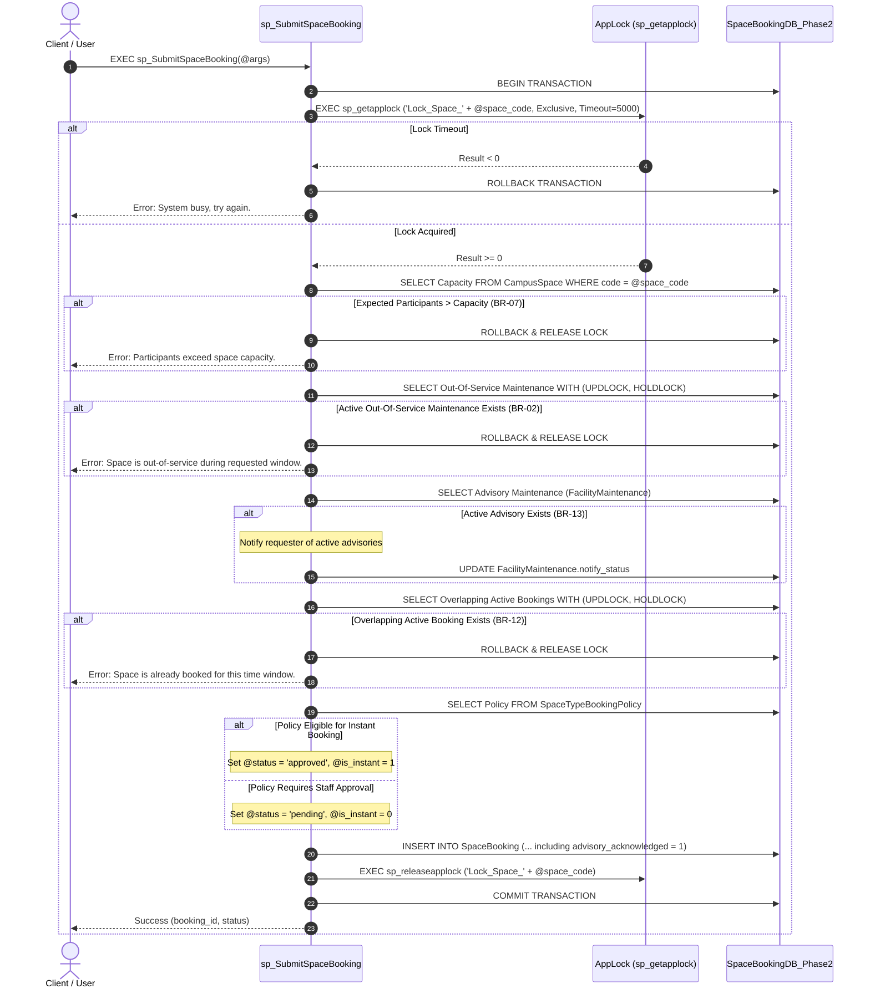

# Concurrency Design Document

**Group:** G02

**Phase:** Phase 2 — Concurrency Design (Step 11)

**Task:** Concurrency Design for the Campus Space Management System

**Target Database:** `SpaceBookingDB_Phase2`

**DBMS:** Microsoft SQL Server

**Generation Date:** 2026-08-02

---

## 1. Concurrency Objectives & System Invariants

### 1.1. Context and Business Rationale
Following Phase 1 piloting, the Campus Space Management System must handle high-volume concurrent operations. At peak times (such as start-of-semester space booking registration periods), multiple students, lecturers, department admins, and facility staff perform booking submissions, automated instant approvals, manual staff approvals, and maintenance updates simultaneously.

Without strict database-level concurrency control, concurrent operations checking space availability before recording results can lead to race conditions, lost updates, and data corruption.

### 1.2. Core Database System Invariants
The concurrency control architecture must guarantee that the following business invariants hold true across all execution paths under concurrent execution:

1. **BR-01 / BR-12: Overlap Prevention Invariant (Double-Allocation Protection)**
   $$\forall b_1, b_2 \in \text{SpaceBooking}, \quad (b_1.\text{campus\_space\_code} = b_2.\text{campus\_space\_code} \;\land\; b_1.\text{space\_booking\_id} \neq b_2.\text{space\_booking\_id} \;\land\; b_1.\text{status} \in S_{\text{active}} \;\land\; b_2.\text{status} \in S_{\text{active}}) \implies (b_1.\text{requested\_end\_time} \le b_2.\text{requested\_start\_time} \;\lor\; b_2.\text{requested\_end\_time} \le b_1.\text{requested\_start\_time})$$
   *Where $S_{\text{active}} = \{\text{'approved'}, \text{'checked\_in'}, \text{'completed'}, \text{'no-show'}\}$.*  
   **Rule:** No two active bookings for the same space may have overlapping time periods, regardless of whether the bookings were created through instant auto-approval or staff manual approval.

2. **BR-02 / BR-09: Maintenance Blocking Invariant**
   $$\forall b \in \text{SpaceBooking}, \; \forall m \in \text{SpaceMaintenance}, \quad (b.\text{campus\_space\_code} = m.\text{campus\_space\_code} \;\land\; b.\text{status} \in S_{\text{active}} \;\land\; m.\text{status} \in \{\text{'reported'}, \text{'in\_progress'}\} \;\land\; m.\text{impact\_level} = \text{'out\_of\_service'}) \implies (b.\text{requested\_end\_time} \le m.\text{start\_time} \;\lor\; m.\text{completion\_time} \le b.\text{requested\_start\_time})$$
   **Rule:** A space with an active maintenance record having `impact_level = 'out_of_service'` cannot be booked for any overlapping time window. Advisory maintenance (`impact_level = 'advisory'`) must never block bookings.

3. **BR-13: Advisory Notification Invariant**
   When a booking is submitted for a space with active advisory-level maintenance (`FacilityMaintenance` records with `impact_level = 'advisory'` and `status IN ('reported', 'in_progress')`), the system must notify the requester. Notification processing updates `FacilityMaintenance.notify_status`. Advisory maintenance never blocks booking creation.
   **Rule:** If a space has active advisory maintenance records during the requested window, the requester must be informed before the booking is finalized, and the acknowledgement must be recorded on the booking (`SpaceBooking.advisory_acknowledged = 1`). `sp_SubmitSpaceBooking` always informs the requester of what is available for the space, so the acknowledgement is stored with every booking it inserts.

4. **BR-03 & BR-07: Lifecycle Transition and Capacity Invariants**
   - New bookings enter as `pending` (staff workflow, `is_instant_booking = 0`) or `approved` (instant booking workflow, `is_instant_booking = 1`).
   - Booking `expected_participants` must never exceed space `capacity`.

### 1.3. Concurrency Control Goals
- **Serializability & Correctness:** Guarantee absolute compliance with BR-12 and BR-02 under arbitrary concurrent operation interleavings.
- **Deadlock Avoidance:** Enforce strict lock acquisition ordering and explicit lock timeouts.
- **Performance & Minimal Contention:** Scope locks to specific space codes (`campus_space_code`) rather than locking entire tables, ensuring high throughput across non-conflicting spaces.

---

## 2. Concurrency Errors Identification & Reproduction

This section identifies **two critical concurrency errors / race conditions** that occur in the un-isolated database system, providing full SQL reproduction scripts and step-by-step execution instructions.

---

### 2.1. Concurrency Error 1: Concurrent Instant Booking Double-Allocation

#### 2.1.1. Error Analysis
- **Error Category:** Write Skew / Phantom Read Race Condition.
- **Involved Business Rules:** BR-01, BR-11, BR-12.
- **Affected Entities:** `SpaceBooking`, `CampusSpace`, `SpaceTypeBookingPolicy`.
- **Race Condition Description:**
  Under peak registration (e.g., start of semester), User 4 (Hoàng Thị Mai, lecturer) and User 5 (Trương Minh Tâm, student) simultaneously submit instant booking requests for classroom `B101` (Lecture Room 101, capacity 60) for the overlapping time window `2026-09-10 10:00` to `2026-09-10 12:00`.
  
  Under default `READ COMMITTED` isolation without explicit locking:
  1. Transaction A (User 4) checks for overlapping approved bookings in `SpaceBooking`. It reads `0` matching rows.
  2. Transaction B (User 5) checks for overlapping approved bookings in `SpaceBooking`. Because Transaction A has not committed, Transaction B also reads `0` matching rows.
  3. Transaction A executes `INSERT INTO SpaceBooking ... status = 'approved', is_instant_booking = 1` and commits.
  4. Transaction B executes `INSERT INTO SpaceBooking ... status = 'approved', is_instant_booking = 1` and commits.
  
  **Result:** Two `approved` bookings exist for `B101` during `10:00–12:00`. The system violates invariant BR-12 (double allocation).

#### 2.1.2. Reproduction Script Reference
The complete T-SQL reproduction script for Error 1 is maintained in a dedicated standalone file:
- [11-reproduce-concurrency-error1-G02.sql](file:///c:/Users/Admin/Programming/CS486_Project/outputs/11-reproduce-concurrency-error1-G02.sql)

The script is organized into three sections:
1. **Setup Phase**: Enables classroom instant booking in `SpaceTypeBookingPolicy` and cleans up existing test records for space `B101` on the target date.
2. **Interleaved Session Statements**:
   - **Session A (Step A1)**: Opens a transaction and reads existing active bookings for `B101`. Returns `0` matching rows.
   - **Session B (Step B1 & B2)**: Opens a concurrent transaction, reads `B101` availability (reads `0` rows as Session A is uncommitted), inserts an approved instant booking for User 5, and commits.
   - **Session A (Step A2)**: Resumes, inserts an approved instant booking for User 4, and commits.
3. **Verification Query**: Queries `SpaceBooking` for space `B101` on the target window, demonstrating two conflicting `approved` bookings.

#### 2.1.3. Step-by-Step Reproduction Instructions
1. Open **SQL Server Management Studio (SSMS)** and connect to the SQL Server instance hosting `SpaceBookingDB_Phase2`.
2. Open a new Query Window, paste the **Reproduction Setup** script, and execute it once.
3. Open **Query Window 1** (representing **Session A**).
4. Open **Query Window 2** (representing **Session B**).
5. In **Session A**, execute **STEP A1** (`BEGIN TRANSACTION` and `SELECT COUNT(*)`). Observe `OverlapCount = 0`.
6. In **Session B**, execute **STEP B1 & STEP B2** (`BEGIN TRANSACTION`, `SELECT COUNT(*)`, `INSERT`, and `COMMIT`). Observe `OverlapCount = 0` and Session B commits cleanly.
7. Switch back to **Session A** and execute **STEP A2** (`INSERT` and `COMMIT`). Session A commits cleanly.
8. Open a new Query Window and run the **Verification Query**.
9. **Observed Failure:** Both Session A and Session B successfully inserted `approved` bookings for `B101` from `10:00` to `12:00`. BR-12 is violated.

---

### 2.2. Concurrency Error 2: Concurrent Staff Approval vs. Maintenance Escalation

#### 2.2.1. Error Analysis
- **Error Category:** Read / Write Skew & Stale Read Race Condition.
- **Involved Business Rules:** BR-02, BR-09, BR-14.
- **Affected Entities:** `SpaceBooking`, `SpaceMaintenance`, `CampusSpace`, `BookingApproval`.
- **Race Condition Description:**
  User 5 (Trương Minh Tâm, student) submits a booking request for computer lab `C301` (Computer Lab Alpha, capacity 40) for `2026-09-15 14:00–16:00` (stored as `status = 'pending'`).
  Later, Staff Member (facility staff user 2452) opens the approval screen to approve this booking. Simultaneously, Facility Staff (facility staff user 2451) escalates an active `advisory` maintenance record on `C301` to `out_of_service` for `2026-09-15 13:00–17:00`.
  
  Under default `READ COMMITTED` execution:
  1. Session A (facility staff user 2452) checks if `C301` has active `out_of_service` maintenance during `14:00–16:00`. Because Session B has not committed its escalation update, Session A reads `0` matching rows.
  2. Session B (facility staff user 2451) executes `UPDATE SpaceMaintenance SET impact_level = 'out_of_service' WHERE space_maintenance_id = ...` and commits.
  3. Session A proceeds to execute `UPDATE SpaceBooking SET status = 'approved' WHERE space_booking_id = ...` and inserts a `BookingApproval` record, then commits.
  
  **Result:** Booking is approved for computer lab `C301` during a time window when `C301` is under `out_of_service` maintenance. Invariant BR-02 is violated.

#### 2.2.2. Reproduction Script Reference
The complete T-SQL reproduction script for Error 2 is maintained in a dedicated standalone file:
- [11-reproduce-concurrency-error2-G02.sql](file:///c:/Users/Admin/Programming/CS486_Project/outputs/11-reproduce-concurrency-error2-G02.sql)

The script is organized into three sections:
1. **Setup Phase**: Inserts a `pending` booking for computer lab `C301` (User 5, requester_id = 5) and an active `advisory` maintenance record (reporter_id = 2001, assigned_staff_id = 2451) covering the same time window.
2. **Interleaved Session Statements**:
   - **Session A (Step A1)**: Facility staff user 2452 starts a transaction and checks active `out_of_service` maintenance for `C301`. Reads `0` matching rows.
   - **Session B (Step B1)**: Facility staff user 2451 starts a transaction, updates `SpaceMaintenance.impact_level` from `advisory` to `out_of_service`, and commits.
   - **Session A (Step A2)**: Facility staff user 2452 resumes, updates booking status to `approved`, inserts `BookingApproval` (staff_id = 2452), and commits.
3. **Verification Query**: Queries `SpaceBooking` and `SpaceMaintenance` for `C301`, demonstrating an `approved` booking overlapping an active `out_of_service` maintenance.

#### 2.2.3. Step-by-Step Reproduction Instructions
1. Open **SSMS** and execute the **Reproduction Setup for Error 2** script once.
2. Open **Query Window 1 (Session A)** and **Query Window 2 (Session B)**.
3. In **Session A**, execute **STEP A1** (`BEGIN TRANSACTION` and maintenance check `SELECT`). Observe `OutOfServiceMaintCount = 0`.
4. In **Session B**, execute **STEP B1** (`BEGIN TRANSACTION`, `UPDATE SpaceMaintenance SET impact_level = 'out_of_service'`, and `COMMIT`). Session B commits cleanly.
5. Switch to **Session A** and execute **STEP A2** (`UPDATE SpaceBooking SET status = 'approved'`, `INSERT INTO BookingApproval`, and `COMMIT`). Session A commits.
6. Run the **Verification Query for Error 2**.
7. **Observed Failure:** The booking status is `'approved'`, yet the space has an active `out_of_service` maintenance record overlapping the exact same timeframe. Invariant BR-02 is violated.

---

## 3. Isolation Levels & Locking Strategy Design

To prevent all identified race conditions, the system requires a robust, scalable concurrency control model tailored to Microsoft SQL Server.

### 3.1. Evaluation of T-SQL Isolation Levels

| Isolation Level | Overlap Race Protection | Escalation Race Protection | Performance & Deadlock Profile | Suitability Assessment |
|---|---|---|---|---|
| **`READ COMMITTED`** (Default) | No | No | High concurrency, zero blocking on reads. | **Unsuitable.** Fails BR-12 and BR-02 under concurrent write workflows. |
| **`REPEATABLE READ`** | No | Yes | Holds Shared (`S`) locks until commit. Prevents update skew on existing rows, but permits phantom insertions. | **Unsuitable.** Does not block new overlapping booking inserts. |
| **`SERIALIZABLE`** | Yes | Yes | Holds Key-Range locks (`RangeS-S`, `RangeI-N`). Fully prevents phantoms. | **Partially Suitable.** Prevents phantoms, but range locking on empty index ranges causes frequent deadlocks when multiple concurrent transactions read before inserting. |
| **`SNAPSHOT`** | Yes (with retry) | Yes (with retry) | Uses tempdb row versioning. Reads never block writes. | **Partially Suitable.** Eliminates read locks, but concurrent update collisions throw exception 3960, requiring complex application-level retry loops. |

### 3.2. Chosen Concurrency Control Model: Application Locks & Update Range Hints
To achieve strict serializability without deadlocks or complex application retry logic, the system adopts a **hybrid pessimistic locking architecture**:

1. **Application-Level Resource Locking via `sp_getapplock`:**
   - Every booking submission, staff approval, and maintenance escalation must acquire an explicit, exclusive application lock keyed by space code:
     $$\text{Resource Key} = \text{'Lock\_Space\_' + @campus\_space\_code}$$
   - Because `sp_getapplock` operates at the application/resource level, all write workflows for a specific space are strictly **serialized per space**, while operations on different spaces run in full parallel with zero contention.

2. **Explicit Key-Range Update Lock Hints (`WITH (UPDLOCK, HOLDLOCK)`):**
   - Inside database transactions, range check queries use `WITH (UPDLOCK, HOLDLOCK)` hints on target tables (`SpaceBooking` and `SpaceMaintenance`).
   - `UPDLOCK` acquires Update locks instead of Shared locks during the read phase, preventing two transactions from simultaneously reading the same range with intent to modify (eliminating conversion deadlocks).
   - `HOLDLOCK` holds range locks until transaction commit, guaranteeing serializable range stability.

### 3.3. Lock Acquisition Ordering & Deadlock Prevention Rules
To ensure absolute freedom from deadlocks across all procedures, all transactions must strictly adhere to the following **Global Lock Acquisition Hierarchy**:

#### Deadlock Prevention Rules:
1. **Hierarchical Ordering:** Always lock the parent resource (`campus_space_code` via `sp_getapplock`) before accessing child records (`SpaceMaintenance`, `SpaceBooking`).
2. **Explicit Lock Timeout:** `sp_getapplock` is invoked with `@LockTimeout = 5000` (5 seconds). If a transaction cannot acquire the lock within 5 seconds, it aborts immediately with a clean error message rather than blocking indefinitely.
3. **No User Interaction:** Transactions are executed inside atomic stored procedures. User inputs or interactive wait steps must never occur inside an active transaction boundary.

---

## 4. Concurrency Control Transaction Specifications

This section specifies the technical transaction boundaries, isolation settings, and locking protocols for core system procedures.

---

### 4.1. Procedure 1: Booking Submission Protocol (`sp_SubmitSpaceBooking`)

#### 4.1.1. Purpose & Scope
Handles both instant auto-approval bookings (BR-11) and manual staff workflow submissions for any space, enforcing BR-01, BR-02, BR-07, BR-12, and BR-13 transactionally.

#### 4.1.2. Transaction Flowchart

#### 4.1.3. Specification Details
- **Transaction Boundary:** Enclosed in `BEGIN TRANSACTION` … `COMMIT TRANSACTION`.
- **Lock Acquisition:** `EXEC sp_getapplock @Resource = @LockResource, @LockMode = 'Exclusive', @LockOwner = 'Transaction', @LockTimeout = 5000`.
- **Validation Queries:**
  - Range lock on maintenance: `SELECT ... FROM SpaceMaintenance WITH (UPDLOCK, HOLDLOCK) WHERE campus_space_code = @campus_space_code AND impact_level = 'out_of_service' AND status IN ('reported', 'in_progress') AND OverlapCondition`.
  - Range lock on bookings: `SELECT ... FROM SpaceBooking WITH (UPDLOCK, HOLDLOCK) WHERE campus_space_code = @campus_space_code AND status IN ('approved', 'checked_in', 'completed', 'no-show') AND OverlapCondition`.
- **Atomic Modification:** `INSERT INTO SpaceBooking (...)` including `advisory_acknowledged = 1` — the procedure always informs the requester of what is available for the space before finalizing the booking, so the BR-13 acknowledgement is stored with the booking at insert time.
- **Invariant Guarantee:** Absolute protection against Error 1 (Double Allocation) and Error 2 (Booking during Maintenance).

---

### 4.2. Procedure 2: Staff Booking Approval Protocol (`sp_ApproveSpaceBooking`)

#### 4.2.1. Purpose & Scope
Processes staff decision (`approved` or `rejected`) on a `pending` booking, ensuring re-validation of overlap and maintenance rules at decision time.

#### 4.2.2. Specification Details
- **Input Parameters:** `@space_booking_id`, `@staff_id`, `@decision` (`'approved'` or `'rejected'`), `@decision_note`, `@rejection_reason`.
- **Transaction Boundary:** Single atomic transaction with `sp_getapplock`.
- **Execution Protocol:**
  1. `BEGIN TRANSACTION`
  2. Read target booking: `SELECT @campus_space_code = campus_space_code, @status = status FROM SpaceBooking WHERE space_booking_id = @space_booking_id`.
  3. Validate `@status = 'pending'`. If not pending, rollback (prevents double approval / invalid transition).
  4. Acquire exclusive application lock on `@campus_space_code`.
  5. If `@decision = 'approved'`:
     - Re-check space availability using the shared function `fn_IsSpaceAvailable` (rejects when the space is closed/retired, under active `out_of_service` maintenance overlapping the window, or an overlapping approved-lifecycle booking exists). If unavailable, rollback.
     - Execute `INSERT INTO BookingApproval (space_booking_id, staff_id, decision, ...)`. `SpaceBooking.status` is not updated manually — the trigger `trg_BookingApproval_UpdateBookingStatus` (10 §7) syncs it to `'approved'`.
  6. If `@decision = 'rejected'`:
     - Execute `INSERT INTO BookingApproval (space_booking_id, staff_id, decision, rejection_reason, ...)`; the same trigger syncs `SpaceBooking.status` to `'rejected'`.
  7. Release application lock and `COMMIT TRANSACTION`.

---

### 4.3. Procedure 3: Maintenance Impact Escalation Protocol (`sp_EscalateSpaceMaintenance`)

#### 4.3.1. Purpose & Scope
Changes a maintenance record's impact level between `advisory` and `out_of_service`, updates space status, and identifies all affected approved/checked-in bookings for staff outreach (BR-14). The default `@new_impact_level = 'out_of_service'` implements escalation; passing `'advisory'` implements the Phase 2 downgrade direction.

#### 4.3.2. Specification Details
- **Input Parameters:**
  - `@space_maintenance_id` — the maintenance record whose impact level is being changed.
  - `@staff_id` — the facility staff member performing the operation.
  - `@new_impact_level NVARCHAR(20) = 'out_of_service'` — the target impact level; must be `'out_of_service'` or `'advisory'` (matches the schema CHECK constraint). Defaults to `'out_of_service'` (escalation) and also supports the downgrade direction.
  - `@affected_count INT OUTPUT` — number of approved/checked-in bookings overlapping the maintenance interval; the affected rows are also returned as a result set (BR-14 outreach).
- **Pre-lock Validation:**
  - `@new_impact_level` must be `'out_of_service'` or `'advisory'`.
  - The maintenance record must exist and be open (`status IN ('reported', 'in_progress')`); completed/cancelled records cannot change impact level.
  - `@staff_id` must exist with role `facility_staff` or `facility_manager`.
- **Execution Protocol:**
  1. `BEGIN TRANSACTION`
  2. Read maintenance record details: `SELECT @campus_space_code = campus_space_code, @current_impact = impact_level, @maint_status = status, @start_time = start_time, @completion_time = completion_time FROM SpaceMaintenance WHERE space_maintenance_id = @space_maintenance_id`.
  3. Acquire exclusive application lock on `@campus_space_code` (lock resource `N'Lock_Space_' + @campus_space_code`, timeout 5000 ms).
  4. Update maintenance impact:  
     `UPDATE SpaceMaintenance SET impact_level = @new_impact_level WHERE space_maintenance_id = @space_maintenance_id`.
  5. Trigger `trg_SpaceMaintenance_UpdateSpaceStatus` automatically fires within the transaction, setting `CampusSpace.current_status = 'under_maintenance'` when escalated to `out_of_service`.
  6. Query and return affected approved/checked-in bookings overlapping the maintenance window using `WITH (UPDLOCK, HOLDLOCK)` range locks for staff notification (BR-14 impact analysis set), treating `completion_time IS NULL` as an open-ended interval `[start_time, +infinity)`; set `@affected_count = @@ROWCOUNT`.
  7. Release application lock and `COMMIT TRANSACTION`.

---

## 5. Traceability and Verification Summary

The proposed concurrency control design maintains complete traceability back to the Phase 2 requirements and output design artifacts:

| Business Rule / Invariant | Concurrency Challenge | Technical Mitigation in Step 11 Design | Target Implementation Artifact (Step 12) |
|---|---|---|---|
| **BR-01 / BR-12** (No Overlap) | Race condition during concurrent instant submissions or staff approvals | `sp_getapplock` per space + `WITH (UPDLOCK, HOLDLOCK)` overlap check in `sp_SubmitSpaceBooking` | `12-concurrency-implementation-G02.sql` |
| **BR-02 / BR-09** (Maintenance Blocking) | Concurrent staff approval during maintenance escalation | Serialized space locking in `sp_ApproveSpaceBooking` & `sp_EscalateSpaceMaintenance` | `12-concurrency-implementation-G02.sql` |
| **BR-13** (Advisory Notification) | Stale advisory status during submission | Atomic advisory check and `FacilityMaintenance.notify_status` update inside locked `sp_SubmitSpaceBooking`; the acknowledgement is recorded on the booking (`SpaceBooking.advisory_acknowledged = 1`) | `12-concurrency-implementation-G02.sql` |
| **BR-14** (Escalation Impact Analysis) | Phantom/dirty reads during affected booking identification | Range lock `WITH (UPDLOCK, HOLDLOCK)` inside `sp_EscalateSpaceMaintenance` | `12-concurrency-implementation-G02.sql` |
| **BR-03 & BR-07** (Transitions & Capacity) | Concurrent double check-in / capacity violation | Enforced transactionally via `trg_SpaceBooking_StatusTransition` & `trg_SpaceBooking_CapacityCheck` | `10-schema-migration-G02.sql` / `12` |

---

